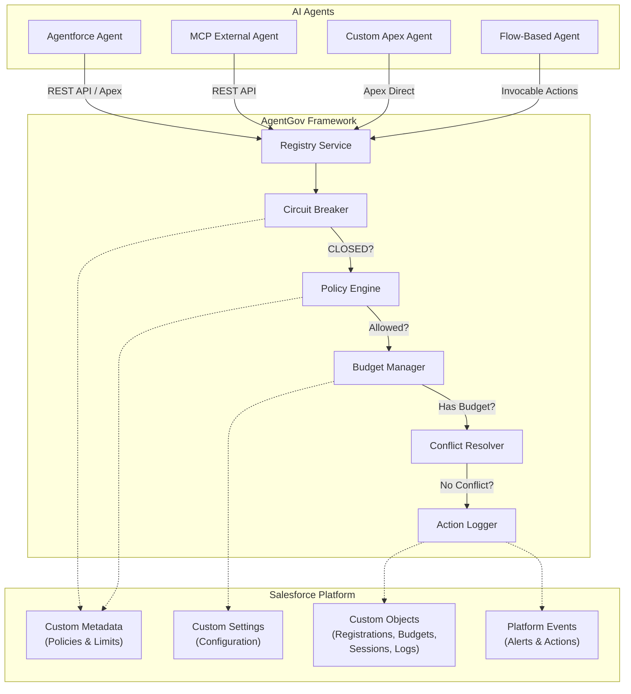
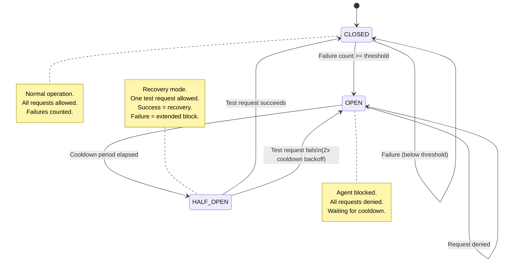
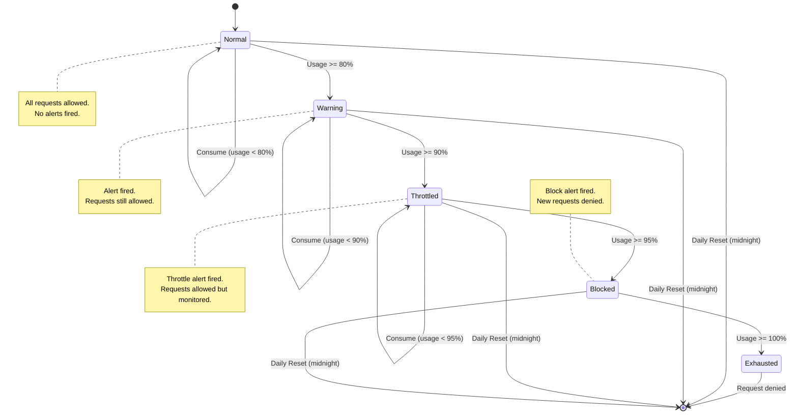

```
     _                    _    ____
    / \   __ _  ___ _ __ | |_ / ___| _____   __
   / _ \ / _` |/ _ \ '_ \| __| |  _ / _ \ \ / /
  / ___ \ (_| |  __/ | | | |_| |_| | (_) \ V /
 /_/   \_\__, |\___|_| |_|\__|\____|\___/ \_/
         |___/
```

# AgentGov

**Salesforce-native governance framework for AI agents. Manage governor limits, resolve conflicts, enforce policies, and monitor agent health -- all natively on the platform.**

[](https://opensource.org/licenses/MIT)
[](https://developer.salesforce.com/)
[](https://github.com/himanshupalerwal/salesforce-agent-governance)
[](https://github.com/himanshupalerwal/salesforce-agent-governance/releases)

---

## Why AgentGov?

AI agents on Salesforce are powerful -- but unchecked, they become dangerous. A single runaway agent can exhaust your org's daily API limits, overwrite records that another agent is processing, or silently violate data access policies. As organizations deploy more agents (Agentforce, MCP-connected external models, custom Apex bots, Flow-based automations), the governance gap widens fast.

**AgentGov closes that gap.** It provides a declarative, metadata-driven framework that sits between your agents and the Salesforce platform. Every agent action passes through budget checks, policy evaluation, conflict detection, and circuit breaker validation -- before a single DML statement executes. When something goes wrong, the framework automatically throttles or disables the offending agent, fires real-time platform events, and logs everything for audit.

No external infrastructure. No managed package dependencies. Pure Salesforce-native Apex, Custom Objects, Custom Metadata Types, Platform Events, and Flows.

---

## Architecture



### Request Lifecycle

Every agent action follows this pipeline:

1. **Registry Check** -- Is the agent registered and active?
2. **Circuit Breaker** -- Is the agent's circuit breaker CLOSED (healthy)?
3. **Policy Evaluation** -- Does the agent have permission for this object and operation?
4. **Budget Check** -- Does the agent have remaining governor budget for today?
5. **Conflict Detection** -- Is another agent currently modifying this record?
6. **Action Logging** -- Record the action via platform events for real-time monitoring.

If any step fails, the request is denied with a specific error code. The agent is never left guessing about *why* it was blocked.

---

## Key Features

### 1. Governor Budget Management
Track and enforce daily limits on API calls, SOQL queries, and DML operations per agent. Budgets reset automatically at midnight. Configurable warning (80%), throttle (90%), and block (95%) thresholds fire real-time alerts as agents approach their limits.

### 2. Circuit Breaker Pattern
Automatically disable misbehaving agents using the industry-standard circuit breaker pattern. After a configurable number of failures, the breaker trips to OPEN state, blocking all requests. After a cooldown period, it transitions to HALF_OPEN for a test request. A successful test closes the breaker; a failure re-opens it with exponential backoff.

### 3. Policy Engine
Declarative, metadata-driven access control. Define which agent types can perform which operations on which objects -- all through Custom Metadata Type records. Supports wildcards, field-level restrictions, and per-transaction record limits. No code changes required to add or modify policies.

### 4. Conflict Resolution
Detect and resolve conflicts when multiple agents attempt to modify the same record. Uses in-memory record locking with priority-based resolution. Higher-priority agents can override lower-priority locks. All conflicts are logged with severity levels for post-incident analysis.

### 5. Real-Time Monitoring
Platform Events (`AgentGov_Alert__e` and `AgentGov_Action_Event__e`) provide real-time visibility into agent activity. Subscribe from LWC dashboards, Streaming API clients, or trigger follow-up automations. Every budget threshold crossing, circuit breaker trip, and policy violation fires an event.

### 6. Flow-Native Integration
Four invocable actions make AgentGov accessible from any Salesforce Flow -- no Apex required:
- **Register Agent Action** -- Check policy + consume budget + log action in one call
- **Check Agent Budget** -- Read-only budget status check
- **Get Agent Status** -- Health and circuit breaker state
- **Log Agent Action** -- Record an action for audit

---

## Quick Start

### Step 1: Deploy to your org

```bash
sf project deploy start --source-dir force-app
```

### Step 2: Assign the permission set

```bash
sf org assign permset --name AgentGov_Admin
```

### Step 3: Register your first agent

```apex
AgentGov_Registration__c agent = AgentGovRegistryService.registerAgent(
    'Lead Enrichment Agent',
    'Agentforce',
    'Enriches leads with firmographic data from external APIs',
    'key-lead-enrichment-2024',
    'admin@yourcompany.com'
);
AgentGovRegistryService.activateAgent(agent.Id);
System.debug('Agent registered: ' + agent.Id);
```

---

## Installation

### Prerequisites

- Salesforce CLI (`sf`) installed -- [Install Guide](https://developer.salesforce.com/tools/salesforcecli)
- A Salesforce org (scratch org, sandbox, or Developer Edition)
- System Administrator profile or equivalent permissions

### Deploy via Salesforce CLI

```bash
# Clone the repository
git clone https://github.com/himanshupalerwal/salesforce-agent-governance.git
cd salesforce-agent-governance

# Deploy to your default org
sf project deploy start --source-dir force-app

# Assign admin permission set
sf org assign permset --name AgentGov_Admin

# (Optional) Load sample data
sf apex run --file scripts/setup/load-sample-data.apex
```

### Deploy to a Scratch Org

```bash
# Create a scratch org
sf org create scratch --definition-file config/project-scratch-def.json --alias agentgov-dev --duration-days 30 --set-default

# Push source
sf project deploy start --source-dir force-app --target-org agentgov-dev

# Assign permission set
sf org assign permset --name AgentGov_Admin --target-org agentgov-dev

# Load sample data
sf apex run --file scripts/setup/load-sample-data.apex --target-org agentgov-dev

# Open the org
sf org open --target-org agentgov-dev
```

---

## Usage Examples

### Registering an Agent

```apex
// Register a new Agentforce agent
AgentGov_Registration__c agent = AgentGovRegistryService.registerAgent(
    'Case Routing Agent',           // Agent name
    'Agentforce',                   // Type: Agentforce, MCP_External, Custom_Apex, Flow_Based
    'Routes cases to the best available support rep based on skills and workload',
    'key-case-router-001',          // API key for REST access
    'support-team@yourcompany.com'  // Owner email for alerts
);

// Activate the agent (required before it can perform actions)
AgentGovRegistryService.activateAgent(agent.Id);

// Start a session (tracks activity within a logical unit of work)
AgentGov_Session__c session = AgentGovRegistryService.startSession(agent.Id);
System.debug('Session started: ' + session.Id);

// ... agent performs its work ...

// End the session
AgentGovRegistryService.endSession(session.Id);
```

### Checking Budget Before an Action

```apex
// Check if the agent has budget remaining (read-only, does not consume)
AgentGovBudgetManager.BudgetResult budget = AgentGovBudgetManager.checkBudget(agentId);

if (budget.allowed) {
    System.debug('Budget status: ' + budget.budgetStatus);
    System.debug('API calls remaining: ' + budget.apiCallsRemaining);
    System.debug('SOQL queries remaining: ' + budget.soqlQueriesRemaining);
    System.debug('DML operations remaining: ' + budget.dmlOperationsRemaining);
} else {
    System.debug('Agent is over budget. Status: ' + budget.budgetStatus);
}

// Consume budget (call this when the agent actually performs an action)
AgentGovBudgetManager.BudgetResult result = AgentGovBudgetManager.consumeBudget(
    agentId,
    'API_Calls',  // Limit type: API_Calls, SOQL_Queries, DML_Operations
    1             // Amount to consume
);
```

### Full Authorization Pipeline (Apex)

```apex
// Complete governance check: circuit breaker + policy + budget + conflict detection
Id agentId = '0015g00000XXXXXXXX';
String objectName = 'Lead';
String operation = 'Update';
String recordId = '00Q5g00000YYYYYYYY';

// 1. Circuit Breaker
if (!AgentGovCircuitBreaker.allowRequest(agentId)) {
    System.debug('Circuit breaker is OPEN -- agent blocked');
    return;
}

// 2. Policy Check
AgentGovPolicyEngine.PolicyResult policy = AgentGovPolicyEngine.evaluatePolicy(
    agentId, objectName, operation
);
if (!policy.allowed) {
    System.debug('Policy violation: ' + policy.denialReason);
    return;
}

// 3. Budget Consumption
try {
    AgentGovBudgetManager.consumeBudget(agentId, 'DML_Operations', 1);
} catch (AgentGovException e) {
    System.debug('Budget exceeded: ' + e.getMessage());
    return;
}

// 4. Conflict Detection
AgentGovConflictResolver.ConflictResult conflict =
    AgentGovConflictResolver.checkForConflict(agentId, recordId, objectName);
if (conflict.hasConflict && conflict.winningAgentId != agentId) {
    System.debug('Record locked: ' + conflict.message);
    return;
}

// All checks passed -- proceed with the action
System.debug('Action authorized. Proceeding...');

// Record success for circuit breaker tracking
AgentGovCircuitBreaker.recordSuccess(agentId);
```

### Using the REST API (for MCP and External Agents)

#### Register an Agent

```bash
curl -X POST https://yourinstance.salesforce.com/services/apexrest/agentgov/register \
  -H "Authorization: Bearer $ACCESS_TOKEN" \
  -H "Content-Type: application/json" \
  -d '{
    "agentName": "Lead Enrichment Agent",
    "agentType": "MCP_External",
    "description": "Enriches leads with firmographic data via Clearbit API",
    "apiKey": "mcp-lead-enrichment-abc123",
    "ownerEmail": "data-team@yourcompany.com"
  }'
```

**Response (201):**
```json
{
  "success": true,
  "registrationId": "a0B5g00000XXXXXXXX",
  "registrationNumber": "REG-0001",
  "status": "Inactive",
  "message": "Agent registered successfully. Call activateAgent to enable."
}
```

#### Authorize an Action

```bash
curl -X POST https://yourinstance.salesforce.com/services/apexrest/agentgov/authorize \
  -H "Authorization: Bearer $ACCESS_TOKEN" \
  -H "Content-Type: application/json" \
  -d '{
    "apiKey": "mcp-lead-enrichment-abc123",
    "objectName": "Lead",
    "operation": "Update",
    "recordId": "00Q5g00000YYYYYYYY"
  }'
```

**Response (200):**
```json
{
  "authorized": true,
  "agentId": "a0B5g00000XXXXXXXX",
  "budgetStatus": "Normal",
  "remainingBudget": {
    "apiCalls": 9842,
    "soqlQueries": 4991,
    "dmlOperations": 2987
  },
  "conflict": {
    "detected": false,
    "resolution": null
  }
}
```

#### Check Budget

```bash
curl -X GET https://yourinstance.salesforce.com/services/apexrest/agentgov/budget/a0B5g00000XXXXXXXX \
  -H "Authorization: Bearer $ACCESS_TOKEN"
```

**Response (200):**
```json
{
  "agentId": "a0B5g00000XXXXXXXX",
  "budgetStatus": "Warning",
  "allowed": true,
  "remaining": {
    "apiCalls": 1580,
    "soqlQueries": 920,
    "dmlOperations": 450
  },
  "usagePercent": {
    "apiCalls": 84.2,
    "soqlQueries": 81.6,
    "dmlOperations": 85.0
  }
}
```

#### Check Agent Health

```bash
curl -X GET https://yourinstance.salesforce.com/services/apexrest/agentgov/health/a0B5g00000XXXXXXXX \
  -H "Authorization: Bearer $ACCESS_TOKEN"
```

**Response (200):**
```json
{
  "agentId": "a0B5g00000XXXXXXXX",
  "agentName": "Lead Enrichment Agent",
  "status": "Active",
  "circuitBreakerState": "CLOSED",
  "failureCount": 2,
  "lastFailure": "2025-01-15T14:30:00.000Z",
  "cooldownUntil": null,
  "lastActive": "2025-01-15T16:45:00.000Z"
}
```

### Using Invocable Actions in Flow

AgentGov ships with four invocable actions that appear in the Flow Builder under the **AgentGov** category.

#### Register Agent Action (All-in-One)

The most common pattern. Checks policy, consumes budget, and logs the action in a single call:

```
Flow Element: Action — "Register Agent Action"
Input:
  - Agent Registration ID: {!varAgentId}
  - Action Type: "Update"
  - Object Name: "Case"
  - Record ID: {!$Record.Id}

Output:
  - Authorized → {!varAuthorized}      (Boolean)
  - Budget Status → {!varBudgetStatus}  (Text)
  - Denial Reason → {!varDenialReason}  (Text)

Decision Element:
  - If {!varAuthorized} = true → Proceed with Case update
  - If {!varAuthorized} = false → Log denial, notify admin
```

#### Check Agent Budget

Read-only budget check, useful in a Flow decision before expensive operations:

```
Flow Element: Action — "Check Agent Budget"
Input:
  - Agent Registration ID: {!varAgentId}

Output:
  - Has Budget → {!varHasBudget}              (Boolean)
  - Budget Status → {!varBudgetStatus}          (Text)
  - API Calls Remaining → {!varApiRemaining}    (Number)
  - SOQL Queries Remaining → {!varSoqlRemaining} (Number)
  - DML Operations Remaining → {!varDmlRemaining} (Number)
```

#### Get Agent Status

Check health and circuit breaker state:

```
Flow Element: Action — "Get Agent Status"
Input:
  - Agent Registration ID: {!varAgentId}

Output:
  - Agent Name → {!varAgentName}                  (Text)
  - Agent Status → {!varAgentStatus}              (Text)
  - Circuit Breaker State → {!varCBState}          (Text)
  - Is Healthy → {!varIsHealthy}                  (Boolean)
  - Failure Count → {!varFailureCount}            (Number)
```

---

## REST API Reference

| Method | Endpoint | Description |
|--------|----------|-------------|
| `POST` | `/services/apexrest/agentgov/register` | Register a new agent |
| `POST` | `/services/apexrest/agentgov/authorize` | Authorize an agent action (full pipeline) |
| `GET` | `/services/apexrest/agentgov/budget/{agentId}` | Get current budget status |
| `GET` | `/services/apexrest/agentgov/health/{agentId}` | Get agent health and circuit breaker state |

All endpoints require a valid Salesforce OAuth bearer token in the `Authorization` header.

**Error Response Format:**
```json
{
  "error": "Human-readable error message",
  "errorCode": "BUDGET_EXCEEDED"
}
```

**Error Codes:**

| Code | HTTP Status | Description |
|------|-------------|-------------|
| `INVALID_INPUT` | 400 | Missing or invalid request parameters |
| `AGENT_NOT_FOUND` | 404 | Agent registration ID or API key not found |
| `AGENT_NOT_ACTIVE` | 403 | Agent exists but is not in Active status |
| `BUDGET_EXCEEDED` | 429 | Daily governor budget exhausted |
| `BUDGET_THROTTLED` | 429 | Agent is throttled due to high usage |
| `POLICY_VIOLATION` | 403 | Action denied by policy configuration |
| `CIRCUIT_BREAKER_OPEN` | 503 | Agent is temporarily disabled |
| `RECORD_LOCKED` | 409 | Record is locked by a higher-priority agent |
| `MAX_CONCURRENT_AGENTS` | 429 | Org has reached the max concurrent agent limit |

---

## Configuration

### AgentGov_Settings__c (Custom Settings -- Hierarchy)

Org-level configuration that controls global framework behavior.

| Field | Type | Default | Description |
|-------|------|---------|-------------|
| `Is_Enabled__c` | Checkbox | `true` | Master kill switch for the entire framework |
| `Default_Agent_Priority__c` | Number | `5` | Default priority for new agents (1 = highest) |
| `Max_Concurrent_Agents__c` | Number | `10` | Maximum agents in Active status simultaneously |
| `Circuit_Breaker_Failure_Threshold__c` | Number | `5` | Failures before circuit breaker trips to OPEN |
| `Circuit_Breaker_Cooldown_Minutes__c` | Number | `30` | Minutes before OPEN breaker transitions to HALF_OPEN |
| `Log_Retention_Days__c` | Number | `90` | Days to retain action log records |
| `Enable_Conflict_Detection__c` | Checkbox | `true` | Enable/disable in-memory conflict detection |
| `Enable_Real_Time_Events__c` | Checkbox | `true` | Enable/disable platform event publishing |

### AgentGov_Limit_Config__mdt (Custom Metadata Type)

Configures thresholds for each type of governor limit.

| Field | Type | Description |
|-------|------|-------------|
| `Limit_Type__c` | Text | `API_Calls`, `SOQL_Queries`, or `DML_Operations` |
| `Warning_Threshold__c` | Percent | Usage percentage that triggers a warning alert (default: 80%) |
| `Throttle_Threshold__c` | Percent | Usage percentage that triggers throttling (default: 90%) |
| `Block_Threshold__c` | Percent | Usage percentage that blocks the agent (default: 95%) |
| `Default_Daily_Budget__c` | Number | Default daily allocation for this limit type |
| `Is_Active__c` | Checkbox | Whether this configuration is active |

### AgentGov_Policy__mdt (Custom Metadata Type)

Defines access control policies for agent types.

| Field | Type | Description |
|-------|------|-------------|
| `Agent_Type__c` | Text | Agent type this policy applies to (`Agentforce`, `MCP_External`, `Custom_Apex`, `Flow_Based`, or `All`) |
| `Object_Name__c` | Text | Salesforce object API name, or `*` for all objects |
| `Operation__c` | Text | Operation type (`Query`, `Create`, `Update`, `Delete`, `Upsert`, `API_Call`, `Flow_Trigger`, or `*`) |
| `Is_Allowed__c` | Checkbox | Whether this action is allowed (explicit deny overrides allow) |
| `Field_Restrictions__c` | Text | Comma-separated list of restricted field API names |
| `Max_Records_Per_Transaction__c` | Number | Maximum records this agent type can process per transaction |
| `Description__c` | Text | Human-readable description of the policy intent |

---

## Circuit Breaker State Machine



**Default Configuration:**
- Failure threshold: **5** consecutive failures
- Cooldown period: **30** minutes
- Retry backoff: **2x** multiplier on each re-trip

---

## Governor Budget Lifecycle



**Default Budgets per Agent:**
- API Calls: **10,000** / day
- SOQL Queries: **5,000** / day
- DML Operations: **3,000** / day

Budgets are configured per agent on the `AgentGov_Registration__c` record and can be overridden from the defaults.

---

## Scheduled Jobs

AgentGov includes three scheduled jobs that should be configured after deployment:

```apex
// Daily budget reset (run at midnight)
System.schedule('AgentGov Daily Reset', '0 0 0 * * ?', new AgentGovDailyReset());

// Hourly health check (circuit breaker transitions + orphan session cleanup)
System.schedule('AgentGov Health Check', '0 0 * * * ?', new AgentGovHealthCheck());

// Weekly log cleanup (purge old action logs based on retention setting)
System.schedule('AgentGov Cleanup', '0 0 2 ? * SUN', new AgentGovCleanup());
```

---

## Data Model

| Object | Type | Purpose |
|--------|------|---------|
| `AgentGov_Registration__c` | Custom Object | Agent registry -- one record per agent |
| `AgentGov_Session__c` | Custom Object | Tracks agent sessions (start/end, resource usage) |
| `AgentGov_Budget__c` | Custom Object | Daily budget allocations and consumption |
| `AgentGov_Action_Log__c` | Custom Object | Audit log of all agent actions |
| `AgentGov_Conflict_Log__c` | Custom Object | Record of detected and resolved conflicts |
| `AgentGov_Settings__c` | Custom Settings | Org-level framework configuration |
| `AgentGov_Limit_Config__mdt` | Custom Metadata | Governor limit thresholds |
| `AgentGov_Policy__mdt` | Custom Metadata | Agent access control policies |
| `AgentGov_Alert__e` | Platform Event | Real-time budget and circuit breaker alerts |
| `AgentGov_Action_Event__e` | Platform Event | Real-time action notifications |

---

## Project Structure

```
salesforce-agent-governance/
├── config/
│   └── project-scratch-def.json
├── docs/
│   ├── architecture.md
│   ├── getting-started.md
│   ├── configuration-guide.md
│   ├── api-reference.md
│   ├── rest-api-reference.md
│   ├── flow-integration.md
│   ├── mcp-integration-guide.md
│   ├── troubleshooting.md
│   ├── FAQ.md
│   └── ROADMAP.md
├── force-app/main/default/
│   ├── classes/           # Apex classes (services, selectors, invocables, tests)
│   ├── objects/           # Custom Objects, Custom Settings, Custom Metadata Types
│   ├── permissionsets/    # AgentGov_Admin, AgentGov_User
│   └── ...
├── scripts/
│   └── setup/
├── LICENSE
├── README.md
└── sfdx-project.json
```

---

## Roadmap

| Version | Target | Features |
|---------|--------|----------|
| **v1.1** | Q2 2026 | Email alert templates, admin notification flows |
| **v1.2** | Q3 2026 | Platform Cache integration for budget checks, enhanced LWC dashboard |
| **v1.3** | Q4 2026 | Managed package distribution on AppExchange |
| **v2.0** | 2027 | AI-powered anomaly detection, predictive budget forecasting, multi-org federation |

See [docs/ROADMAP.md](docs/ROADMAP.md) for the full roadmap with details.

---

## Contributing

Contributions are welcome. Please read the [Contributing Guide](CONTRIBUTING.md) before submitting a pull request.

1. Fork the repository
2. Create a feature branch (`git checkout -b feature/your-feature`)
3. Write tests (maintain 90%+ coverage)
4. Commit your changes (`git commit -m 'Add your feature'`)
5. Push to the branch (`git push origin feature/your-feature`)
6. Open a Pull Request

---

## License

This project is licensed under the MIT License. See [LICENSE](LICENSE) for details.

---

## Author

**Himanshu Palerwal** -- 18x Salesforce Certified | Senior Manager & Post Sales Technical Architect

- 15 years in the Salesforce ecosystem
- Currently at **ServiceTitan** -- Senior Manager & Post Sales Technical Architect
- Previously at **JPMorgan Chase** and **Bank of America** -- App Owner & Technical Architect
- Specializing in Apex, LWC, Enterprise Architecture, AI Agents, MCP, and Agentic Architecture at enterprise scale
- LinkedIn: [linkedin.com/in/himanshupalerwal](https://linkedin.com/in/himanshupalerwal)
- GitHub: [github.com/himanshupalerwal](https://github.com/himanshupalerwal)

---

Built with Salesforce, for Salesforce.
