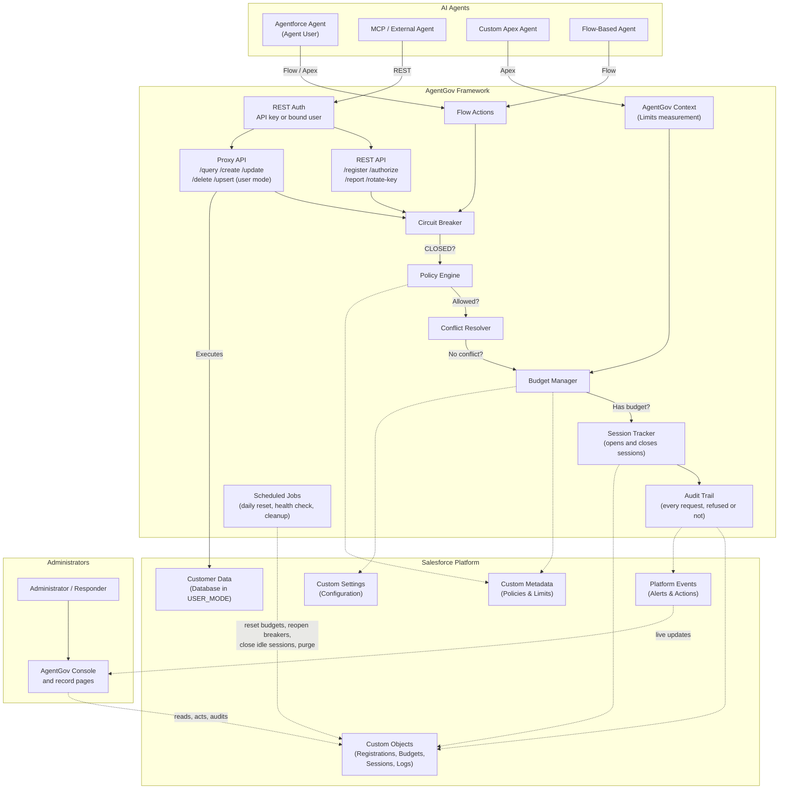
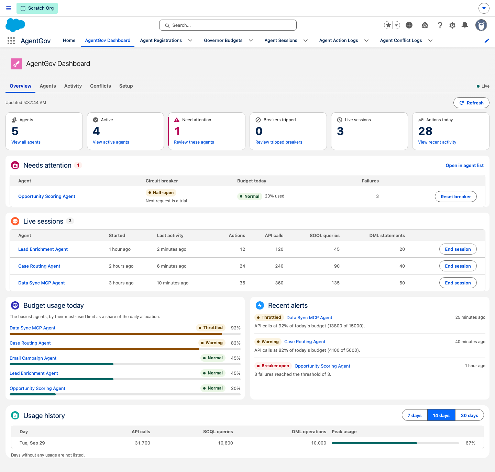
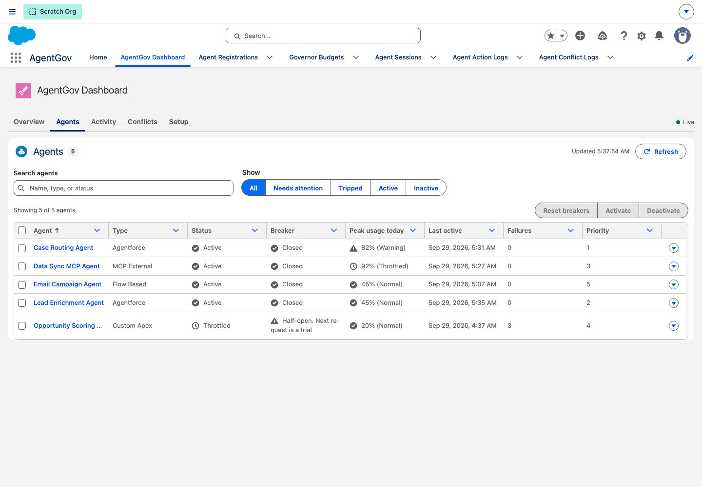
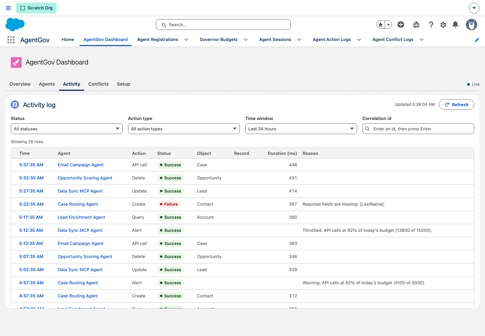
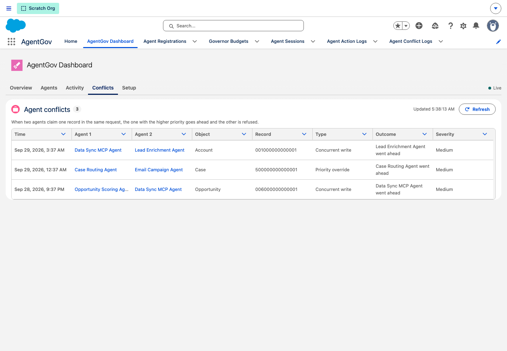
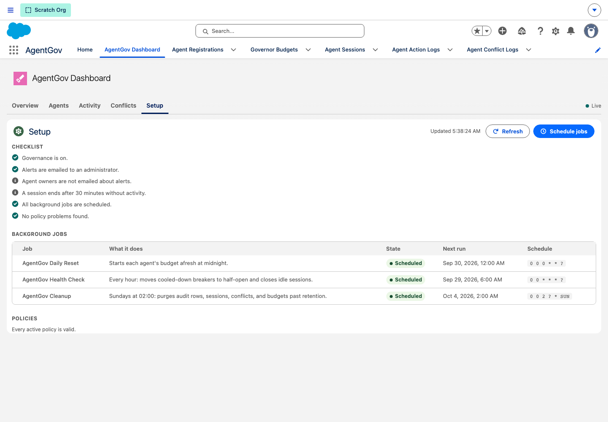
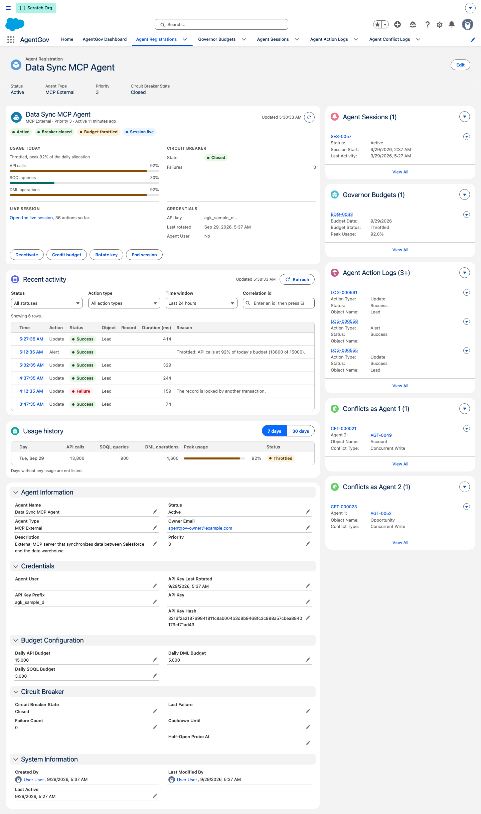
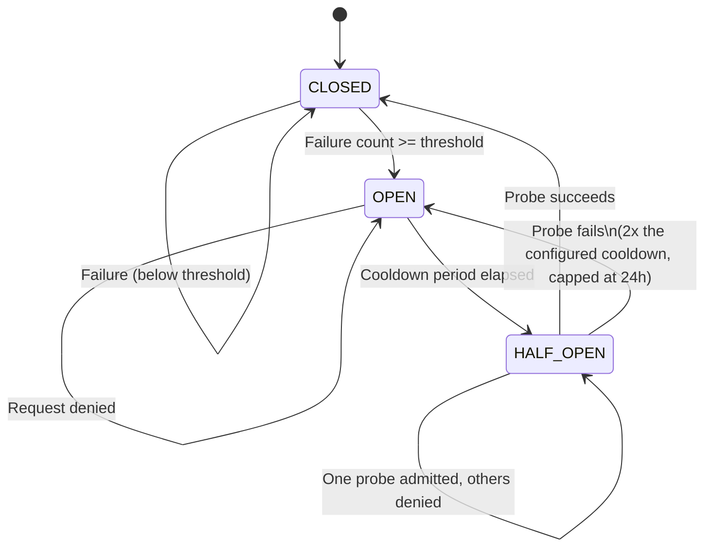
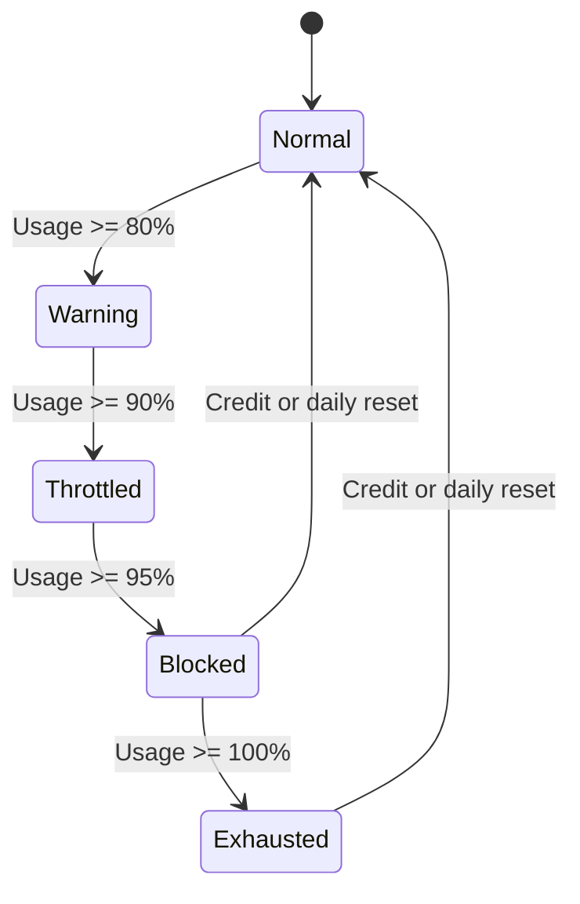

```
     _                    _    ____
    / \   __ _  ___ _ __ | |_ / ___| _____   __
   / _ \ / _` |/ _ \ '_ \| __| |  _ / _ \ \ / /
  / ___ \ (_| |  __/ | | | |_| |_| | (_) \ V /
 /_/   \_\__, |\___|_| |_|\__|\____|\___/ \_/
         |___/
```

# AgentGov

**Salesforce-native governance framework for AI agents. Manage governor limits, resolve conflicts, enforce policies, and monitor agent health -- all natively on the platform.**

[](https://github.com/himanshupalerwal/salesforce-agent-governance/actions/workflows/ci.yml)
[](https://opensource.org/licenses/MIT)
[](https://developer.salesforce.com/)
[](https://github.com/himanshupalerwal/salesforce-agent-governance)
[](https://github.com/himanshupalerwal/salesforce-agent-governance/releases)

---

## Why AgentGov?

AI agents on Salesforce are powerful -- but unchecked, they become dangerous. A single runaway agent can exhaust your org's daily API limits, overwrite records that another agent is processing, or silently violate data access policies. As organizations deploy more agents (Agentforce, MCP-connected external models, custom Apex bots, Flow-based automations), the governance gap widens fast.

**AgentGov closes that gap.** It provides a declarative, metadata-driven framework that sits between your agents and the Salesforce platform. Every proxy request, `/authorize` call, and Register Agent Action request is validated and passes the circuit breaker, policy evaluation, a budget check and, where two agents could claim the same record, conflict detection before the action runs; Apex units measured with `AgentGovContext` are charged for what they actually used once they finish. When something goes wrong, the framework blocks the offending agent, raises a real-time alert that can be emailed to an administrator, and logs everything for audit.

No external infrastructure. No managed package dependencies. Pure Salesforce-native Apex, Custom Objects, Custom Metadata Types, Platform Events, and Lightning Web Components.

---

## Architecture


```mermaid
flowchart TB
    subgraph Agents["AI Agents"]
        A1["Agentforce Agent\n(Agent User)"]
        A2["MCP / External Agent"]
        A3["Custom Apex Agent"]
        A4["Flow-Based Agent"]
    end

    subgraph AgentGov["AgentGov Framework"]
        AUTH["REST Auth\nAPI key or bound user"]
        API["REST API\n/register /authorize\n/report /rotate-key"]
        PROXY["Proxy API\n/query /create /update\n/delete /upsert (user mode)"]
        CTX["AgentGov Context\n(Limits measurement)"]
        INV["Flow Actions"]
        CB["Circuit Breaker"]
        PE["Policy Engine"]
        CR["Conflict Resolver"]
        BM["Budget Manager"]
        ST["Session Tracker\n(opens and closes sessions)"]
        AL["Audit Trail\n(every request, refused or not)"]
        JOBS["Scheduled Jobs\n(daily reset, health check, cleanup)"]
    end

    subgraph Platform["Salesforce Platform"]
        MD["Custom Metadata\n(Policies & Limits)"]
        CS["Custom Settings\n(Configuration)"]
        CO["Custom Objects\n(Registrations, Budgets,\nSessions, Logs)"]
        EVT["Platform Events\n(Alerts & Actions)"]
        SF["Customer Data\n(Database in USER_MODE)"]
    end

    subgraph People["Administrators"]
        ADMIN["Administrator / Responder"]
        CONSOLE["AgentGov Console\nand record pages"]
    end

    A2 -->|"REST"| AUTH
    AUTH --> API
    AUTH --> PROXY
    A1 -->|"Flow / Apex"| INV
    A3 -->|"Apex"| CTX
    A4 -->|"Flow"| INV

    API --> CB
    PROXY --> CB
    INV --> CB
    CTX --> BM
    CB -->|"CLOSED?"| PE
    PE -->|"Allowed?"| CR
    CR -->|"No conflict?"| BM
    BM -->|"Has budget?"| ST
    ST --> AL

    PROXY -->|"Executes"| SF
    PE -.-> MD
    BM -.-> MD
    BM -.-> CS
    ST -.-> CO
    AL -.-> CO
    AL -.-> EVT
    JOBS -.->|"reset budgets, reopen breakers,\nclose idle sessions, purge"| CO

    ADMIN --> CONSOLE
    CONSOLE -.->|"reads, acts, audits"| CO
    EVT -.->|"live updates"| CONSOLE
```

### Request Lifecycle

Every proxy request, `/authorize` call, and Register Agent Action request is checked in this order:

1. **Authentication** -- Who is calling? Over REST and the proxy, the agent's API key in the `X-AgentGov-Key` header (only its SHA-256 hash is stored), or, with no key, the Salesforce user bound to exactly one registration. Register Agent Action takes the agent's registration Id as an input.
2. **Status Check** -- Is the agent registered and active? A deactivated agent is refused. A Blocked agent is let through only once its breaker's cooldown has passed, so the breaker can admit its probe, or while governance is switched off.
3. **Validation** -- Is the request well formed? An unknown object or field, a value a field cannot hold, an unrecognised operation, a malformed record Id, the same record twice, or a filter or sort a field does not support is refused before anything else runs, so it is never charged and never uses up a half-open breaker's probe.
4. **Circuit Breaker** -- Is the breaker CLOSED, or is this the single probe a HALF_OPEN breaker admits?
5. **Policy Evaluation** -- May this agent type perform this operation on this object? Through the proxy, a policy's field restrictions and record cap apply too.
6. **Conflict Detection** -- Has another agent already claimed this record in the same transaction? This applies to `/authorize` with a `recordId`, to proxy updates, upserts, and deletes of existing records, and between the agents in one Register Agent Action batch.
7. **Field Access** (proxy) -- May the calling user read or write every object and field the request touches? Checked in user mode before anything is charged.
8. **Budget Check** -- Does the agent have governor budget left for today? The request is charged here.
9. **Execution and Logging** -- The proxy runs the work in user mode, and every request for a known agent is recorded in the action log, refusals included.

A refusal over REST or the proxy carries a specific error code and a correlation id; Register Agent Action returns `authorized` false with a `denialReason`. The agent is never left guessing about _why_ it was blocked. Validation errors over REST and the proxy, and requests that name no known agent, leave no audit row; Register Agent Action records an unrecognised action type as a `System` row.

Apex measured with `AgentGovContext` runs no breaker, policy, or conflict check: `startTracking` refuses only a deactivated agent, and the unit is charged for its measured usage once it finishes. A deactivated (Inactive) agent is refused by REST, the proxy, Register Agent Action, Report Agent Usage, and `AgentGovContext`, even while governance is switched off. Apex that calls the service classes directly must check `Status__c` itself.

---

## Security model

AgentGov targets API 67.0 (Summer '26), where database operations run in user mode by default. The framework decides the access mode for every code path instead of relying on that default:

| Code path                                                            | Sharing           | Access mode       | Why                                                                                                                                                                      |
| -------------------------------------------------------------------- | ----------------- | ----------------- | ------------------------------------------------------------------------------------------------------------------------------------------------------------------------ |
| Framework records (registrations, budgets, sessions, logs, policies) | `without sharing` | `SYSTEM_MODE`     | Bookkeeping must succeed whoever triggered the action. The user an agent runs as needs no access to AgentGov objects, only the `AgentGov_Agent` permission set.          |
| Operations on the agent's behalf (the proxy)                         | `with sharing`    | `USER_MODE`       | The calling user's object permissions, field-level security, and sharing rules apply to customer data. Queries are compiled from structured input; SOQL text is refused. |
| Dashboards                                                           | `with sharing`    | `USER_MODE`       | People see only what they may see.                                                                                                                                       |
| Console actions (`AgentGovAdminController`)                          | `with sharing`    | `USER_MODE` reads | Each action checks a custom permission on the server first, acts only on agents the person can see, and records an `Admin` audit row in the same transaction.            |

Console actions need `AgentGov_Operate_Agents`; key rotation needs only `AgentGov_Manage_Keys`. `AgentGov_Admin` grants both. On-call staff who should act on agents without handling credentials get `AgentGov_User` plus `AgentGov_Responder`: Responder grants no object, tab, or app access of its own, only `AgentGov_Operate_Agents` and the console's action controller.

API keys are stored only as SHA-256 hashes. An unexpected REST or proxy error (HTTP 500) never includes exception text: everything a POST request wrote, budget charges included, is rolled back, and the response carries a correlation id that finds the logged detail in the action log. Every other error is worded by the framework: a proxy `ACCESS_DENIED` names the object, or the fields, the calling user may not reach. The one exception is a write's per-record result, where each record the database rejects carries the database's own message in `results[].errors`.

---

## Key Features

### 1. Governor Budget Management

Track and enforce daily limits on API calls, SOQL queries, and DML operations per agent. Budgets reset automatically at midnight in the org's default time zone. Configurable warning (80%), throttle (90%), and block (95%) thresholds raise a real-time alert each time an agent's budget status escalates; Warning and Throttled are warnings, and requests are refused only once the budget is Blocked or Exhausted. Exactly one budget row exists per agent per day, even under concurrent first-of-day requests.

### 2. Circuit Breaker Pattern

Automatically disable misbehaving agents using the industry-standard circuit breaker pattern. After a configurable number of failures, the breaker trips to OPEN state, blocking all requests. After a cooldown period, it transitions to HALF_OPEN and admits exactly one probe request. A successful probe closes the breaker; a failed probe reopens it for twice the configured cooldown, capped at one day.

### 3. Policy Engine

Declarative, metadata-driven access control. Define which agent types can perform which operations on which objects -- all through Custom Metadata Type records. Policies are default-allow and deny-wins: an operation no policy matches is allowed, and an explicit deny overrides any allow. Supports wildcards; field-level restrictions and per-transaction record limits apply only to requests made through the proxy. No code changes required to add or modify policies.

### 4. Conflict Resolution

Detect and resolve conflicts when multiple agents attempt to modify the same record. Uses in-memory record locking with priority-based resolution. Higher-priority agents can override lower-priority locks. All conflicts are logged with severity levels for post-incident analysis.

**Scope:** the lock table lives for one Apex transaction, so this catches agents that collide inside a single request: a Register Agent Action batch in which several agents name the same record, or Apex that runs several agents in one transaction. In a batch, the agent with the best priority keeps the record whatever the order of the requests. Separate REST or proxy requests are separate transactions and never conflict with each other. Cross-transaction locking is on the roadmap for v2.0.

### 5. Real-Time Monitoring and Alerts

Platform Events (`AgentGov_Alert__e` and `AgentGov_Action_Event__e`) provide real-time visibility into agent activity. The Lightning console subscribes to them and refreshes live. Each time a budget's overall status escalates, and each time a circuit breaker trips, an alert is recorded as an `Alert` row and emailed to the address in AgentGov Settings, and optionally to each agent's owner. Alerts need `Enable_Real_Time_Events__c`: with it unchecked no alert is recorded or emailed, while action logs are still written directly. Every action row written for a governed request carries the request's correlation id, how long the request had taken, the session its usage was recorded against (if any), and the reason for any refusal. `Alert` rows carry neither the correlation id nor the duration.

### 6. Sessions

Each run of an agent's governed activity is a session. It opens on the agent's first governed call, collects that run's usage and action count, and closes after 30 idle minutes (configurable) or 24 hours; the next call opens a new one. Nothing needs to manage sessions, and an agent never has two active sessions at once.

### 7. An Actionable Console

The AgentGov Console shows what needs attention and lets an administrator act on it: reset a tripped breaker, activate or deactivate an agent, end a session, credit a budget, rotate a key, and schedule the background jobs. Every action is permission-gated and audited. It also has an activity log with filters, daily usage history, an agent record page, and a setup checklist.

### 8. Governed Proxy API (Dynamic Tracking)

Instead of agents calling the Salesforce REST API directly (which AgentGov can't track), agents go through the **Proxy API**, which performs queries and CRUD on their behalf in user mode. A write is charged **one DML unit per record submitted**, before the write runs, so records the database then rejects are still charged; each `/query` costs one SOQL query however many rows it returns.

```bash
# Create 3 Lead records through the proxy → 3 DML units charged, one per record submitted
curl -X POST "$INSTANCE/services/apexrest/agentgov-proxy/create" \
  -H "Authorization: Bearer $TOKEN" -H "X-AgentGov-Key: $AGENT_KEY" -H "Content-Type: application/json" \
  -d '{"objectName":"Lead","records":[
    {"FirstName":"John","LastName":"Doe","Company":"Acme"},
    {"FirstName":"Jane","LastName":"Smith","Company":"Globex"},
    {"FirstName":"Bob","LastName":"Jones","Company":"Initech"}
  ]}'
```

Reads take a structured request, never SOQL text:

```bash
curl -X POST "$INSTANCE/services/apexrest/agentgov-proxy/query" \
  -H "Authorization: Bearer $TOKEN" -H "X-AgentGov-Key: $AGENT_KEY" -H "Content-Type: application/json" \
  -d '{"objectName":"Lead","fields":["Id","Name","Status"],
       "where":[{"field":"Status","op":"=","value":"Open"}],
       "orderBy":{"field":"Name","direction":"ASC"},"limit":50}'
```

Proxy endpoints: `/query`, `/create`, `/update`, `/delete`, `/upsert`. Each validates the whole request, then runs the governance pipeline (circuit breaker → policy → conflict for records that already exist → field-level security → budget) before executing.

For Apex agents, use `AgentGovContext` to measure actual resource consumption via the `Limits` class:

```apex
AgentGovContext.startTracking(agentId);
// ... agent performs SOQL queries, DML operations, callouts ...
AgentGovBudgetManager.BudgetResult result = AgentGovContext.stopTracking();
// Budget consumed by the measured delta, not a self-reported estimate
```

### 9. Flow-Native Integration

Five bulk-safe invocable actions make AgentGov accessible from any Salesforce Flow -- no Apex required:

- **Register Agent Action** -- Check circuit breaker, policy, record conflicts within the batch, and budget, then log the action in one call
- **Check Agent Budget** -- Read-only budget status check
- **Get Agent Status** -- Health and circuit breaker state
- **Log Agent Action** -- Record an action and report its Success or Failure to the agent's circuit breaker
- **Report Agent Usage** -- Charge the resources a Flow actually used

---

## How Budget Tracking Works

AgentGov provides **three ways** to track agent resource consumption. Choose the right one based on your agent type:

| Option                   | Best For               | Accuracy                                      | How It Works                                                                                         |
| ------------------------ | ---------------------- | --------------------------------------------- | ---------------------------------------------------------------------------------------------------- |
| **Proxy API**            | External / MCP agents  | **Exact** — one DML unit per record submitted | AgentGov executes the query or DML on behalf of the agent and charges it before the operation runs   |
| **AgentGovContext**      | Apex agents (same org) | **Transaction-level** — measures Limits delta | Captures `Limits.getQueries()` and `Limits.getDMLStatements()` before and after your agent code runs |
| **/authorize + /report** | Any agent type         | **Agent-reported** with reconciliation        | Agent pre-declares expected cost, then optionally reports actual consumption afterward               |

### Option 1: Proxy API (Recommended for External Agents)

The agent calls AgentGov's proxy endpoints instead of Salesforce's standard REST API. AgentGov performs the operation in the calling user's context and charges by what the agent submits: one DML unit per record in a write, charged before the write runs, and one SOQL query per `/query`, however many rows it returns.

**Why it's the most accurate:** AgentGov controls the DML. Every record the agent submits is charged, including records the database then rejects, so the agent cannot do more work than it is charged for, and there is no way to read or write anything the calling user could not.

### Option 2: AgentGovContext (Recommended for Apex Agents)

Wrap your agent's Apex code between `startTracking()` and `stopTracking()`. AgentGov measures the actual SOQL queries, DML statements, and callouts consumed using Salesforce's `Limits` class.

```apex
AgentGovContext.startTracking(agentId);

List<Lead> leads = [SELECT Id, Status FROM Lead WHERE Status = 'Open'];  // 1 SOQL
for (Lead l : leads) { l.Status = 'Working'; }
update leads;                                                             // 1 DML
insert new Task(Subject = 'Follow up on leads');                          // 1 DML

AgentGovBudgetManager.BudgetResult result = AgentGovContext.stopTracking();
// Measured: 1 SOQL query + 2 DML operations consumed from budget
```

**Or use the convenience wrapper:**

```apex
AgentGovBudgetManager.BudgetResult result = AgentGovContext.executeGoverned(agentId, new EnrichLeads());
// Charges the measured usage; if the action throws, the exception propagates after the charge

// The work goes in any class that implements AgentGovContext.AgentGovAction:
public class EnrichLeads implements AgentGovContext.AgentGovAction {
    public void execute() {
        List<Lead> leads = [SELECT Id FROM Lead WHERE Status = 'Open' LIMIT 100];
        for (Lead lead : leads) {
            lead.Status = 'Working';
        }
        update leads;
    }
}
```

Contexts nest: an inner context's usage is charged to its own agent and excluded from the outer one.

**Important:** This measures everything between start and stop -- including triggers and automations that fire as a result of the agent's DML. This is by design: if an agent's insert triggers three automations, that's the agent's true cost to the org.

### Option 3: /authorize + /report (Flexible, Any Agent Type)

The agent asks permission before acting, then optionally reports what it actually did.

```bash
# Step 1: Pre-authorize (agent declares expected cost)
curl -X POST "$INSTANCE/services/apexrest/agentgov/authorize" \
  -H "Authorization: Bearer $TOKEN" -H "X-AgentGov-Key: $AGENT_KEY" -H "Content-Type: application/json" \
  -d '{"objectName":"Lead","operation":"Update","amount":10}'
# Budget consumed: 10 DML operations (pre-authorized)

# Step 2: Agent does its actual work
# ... agent updates 7 leads ...

# Step 3: Report actual usage (reconciliation)
curl -X POST "$INSTANCE/services/apexrest/agentgov/report" \
  -H "Authorization: Bearer $TOKEN" -H "X-AgentGov-Key: $AGENT_KEY" -H "Content-Type: application/json" \
  -d '{"actual":{"dmlOperations":7},"preAuthorized":{"dmlOperations":10},"success":true}'
# Used 7 of the 10 pre-authorized: nothing further is charged.
# Had it used 12, the extra 2 would be charged now.
```

**Note:** If `amount` is omitted from `/authorize`, it defaults to `1`. The `/report` step is optional but recommended: it charges any usage beyond the pre-authorized amount and reports the outcome to the circuit breaker. Unused pre-authorization is not refunded, because both figures come from the agent and the framework cannot verify them.

---

## Screenshots

> Captured against v1.3 in a new scratch org, after the steps in
> [Getting Started](docs/getting-started.md) with the sample data loaded. The sample API keys are
> the fictional ones in `AgentGovSampleData`, not credentials for any real org.

### Console: Overview

What needs attention, live sessions, the day's busiest budgets, and recent alerts.



### Console: Agents

Every agent with search, filters, sorting, and row and bulk actions.



### Console: Activity

The action log, filtered on the server by status, action type, time window, and request.



### Console: Conflicts



### Console: Setup



### Agent record page

The agent's state, usage, credentials, actions, recent activity, and usage history.



---

## Quick Start

### Step 1: Deploy to your org

```bash
sf project deploy start --source-dir force-app
```

### Step 2: Assign permissions

```bash
# Administrators: full access plus the dashboards
sf org assign permset --name AgentGov_Admin
# Or the group that bundles Admin and User
sf org assign permset --name AgentGov_Operators
```

### Step 3: Register your first agent

```apex
AgentGov_Registration__c agent = AgentGovRegistryService.registerAgent(
    'Account Research Agent',
    'Agentforce',
    'Researches accounts with firmographic data from external APIs',
    null,                          // no key yet
    'owner@example.com'
);
String apiKey = AgentGovRegistryService.issueApiKey(agent.Id);   // shown once; only its hash is stored
AgentGovRegistryService.activateAgent(agent.Id);
```

For an agent that runs as its own Salesforce user (an Agentforce Agent User or an integration user), bind the user instead of issuing a key:

```apex
AgentGovRegistryService.bindAgentUser(agent.Id, agentUserId);
```

A user bound to exactly one registration needs no key. A user bound to several registrations must send the `X-AgentGov-Key` header, or its requests are refused with 403.

---

## Installation

### Prerequisites

- Salesforce CLI (`sf`) installed -- [Install Guide](https://developer.salesforce.com/tools/salesforcecli)
- A Salesforce org on Summer '26 or later (scratch org, sandbox, or Developer Edition)
- System Administrator profile or equivalent permissions

### Deploy via Salesforce CLI

```bash
git clone https://github.com/himanshupalerwal/salesforce-agent-governance.git
cd salesforce-agent-governance

sf project deploy start --source-dir force-app
sf org assign permset --name AgentGov_Admin

# (Optional) Load sample data
sf apex run --file scripts/setup/load-sample-data.apex
```

### Deploy to a Scratch Org

```bash
sf org create scratch --definition-file config/project-scratch-def.json --alias agentgov-dev --duration-days 30 --set-default
sf project deploy start --source-dir force-app --target-org agentgov-dev
sf org assign permset --name AgentGov_Admin --target-org agentgov-dev
sf apex run --file scripts/setup/load-sample-data.apex --target-org agentgov-dev
sf org open --target-org agentgov-dev
```

The scratch org definition enables Agentforce so agents can be built and tested alongside the framework.

### Upgrading from v1.2 or v1.1

1. Remove the scheduled jobs with `scripts/setup/unschedule-jobs.apex`. The platform refuses to deploy a class that a scheduled job uses. The script also removes copies scheduled under names of your own, and its log lists every job it removed.
2. **From v1.1 only:** run `scripts/migrate/dedupe-budgets.apex`, and run it again until it reports that no duplicates remain. The unique daily budget key deploys over duplicate rows, but later writes to those rows fail.
3. Deploy this version.
4. **From v1.1 only:** run `scripts/migrate/hash-api-keys.apex` to move any remaining plaintext API keys to hashed storage (keys are also upgraded automatically the first time each agent connects).
5. Assign `AgentGov_Responder`, together with `AgentGov_User`, to on-call staff who should act on agents from the console without handling API keys. `AgentGov_Admin` already includes both console permissions.
6. Schedule the jobs again with `scripts/setup/schedule-jobs.apex`, and recreate any copies of your own that step 1 listed.

From v1.1, also move REST clients from `apiKey` in the body to the `X-AgentGov-Key` header, and from raw SOQL to the structured `/query` request. `npm run e2e:upgrade` rehearses this path from v1.1 in a scratch org, and `npm run e2e:upgrade -- --from v1.2` from v1.2. The fuller instructions are in [Getting Started](docs/getting-started.md#upgrading-from-v12) (see also [Upgrading from v1.1](docs/getting-started.md#upgrading-from-v11)), and [CHANGELOG.md](CHANGELOG.md) lists every behavior change.

---

## Usage Examples

### Registering an Agent

```apex
AgentGov_Registration__c agent = AgentGovRegistryService.registerAgent(
    'Case Routing Agent',           // Agent name
    'Agentforce',                   // Type: Agentforce, MCP_External, Custom_Apex, Flow_Based
    'Routes cases to the best available support rep based on skills and workload',
    null,                           // API key: null to issue one later, or a key of your choosing (stored hashed)
    'support-team@example.com'      // Owner email for alerts
);

AgentGovRegistryService.activateAgent(agent.Id);
```

Sessions need no code: one opens on the agent's first governed call and closes once the agent has been idle for `Session_Idle_Minutes__c`, or after 24 hours. `AgentGovRegistryService.startSession` and `endSession` remain for a caller that wants an explicit boundary between runs.

### Checking Budget Before an Action

```apex
AgentGovBudgetManager.BudgetResult budget = AgentGovBudgetManager.checkBudget(agentId);

if (budget.allowed) {
    // budget.budgetStatus, budget.apiCallsRemaining, budget.soqlQueriesRemaining, budget.dmlOperationsRemaining
} else {
    // The budget is Blocked or Exhausted on at least one limit type
}

// Consume budget when the agent performs an action
AgentGovBudgetManager.BudgetResult result = AgentGovBudgetManager.consumeBudget(
    agentId,
    'API_Calls',  // Limit type: API_Calls, SOQL_Queries, DML_Operations
    1             // Amount to consume
);
```

### Full Authorization Pipeline (Apex)

```apex
Id agentId = ...;
String objectName = 'Lead';
String operation = 'Update';
Id recordId = ...;

// The service classes do not read Status__c, so a deactivated agent must be stopped here.
AgentGov_Registration__c agent = AgentGovRegistryService.getAgent(agentId);
if (agent == null || agent.Status__c == AgentGovConstants.STATUS_INACTIVE) {
    return; // unknown or deactivated agent
}

if (!AgentGovCircuitBreaker.allowRequest(agentId)) {
    return; // circuit breaker OPEN
}

AgentGovPolicyEngine.PolicyResult policy = AgentGovPolicyEngine.evaluatePolicy(agentId, objectName, operation);
if (!policy.allowed) {
    return; // policy.denialReason explains why
}
AgentGovPolicyEngine.assertFieldsAllowed(policy, new Set<String>{ 'Status', 'Rating' });

AgentGovConflictResolver.assertNoConflict(agentId, recordId, objectName);

try {
    AgentGovBudgetManager.consumeBudget(agentId, 'DML_Operations', 1);
} catch (AgentGovException e) {
    return; // BUDGET_EXCEEDED
}

// ... perform the action ...
AgentGovCircuitBreaker.recordSuccess(agentId);
```

### Using the REST API (for MCP and External Agents)

#### Register an Agent

```bash
curl -X POST "$INSTANCE/services/apexrest/agentgov/register" \
  -H "Authorization: Bearer $ACCESS_TOKEN" -H "Content-Type: application/json" \
  -d '{
    "agentName": "Lead Enrichment Agent",
    "agentType": "MCP_External",
    "description": "Enriches leads with firmographic data",
    "ownerEmail": "data-team@example.com"
  }'
```

**Response (201):**

```json
{
  "success": true,
  "correlationId": "4c0f...",
  "registrationId": "a0B...",
  "registrationNumber": "AGT-0001",
  "status": "Inactive",
  "apiKey": "agk_...",
  "apiKeyPrefix": "agk_5e2a9c1d",
  "message": "Agent registered. Store the apiKey now; only its hash is kept and it cannot be retrieved later. Activate the agent to enable it."
}
```

A value the database rejects, such as a malformed `ownerEmail`, returns 400 `INVALID_INPUT`.

#### Authorize an Action

```bash
curl -X POST "$INSTANCE/services/apexrest/agentgov/authorize" \
  -H "Authorization: Bearer $ACCESS_TOKEN" -H "X-AgentGov-Key: $AGENT_KEY" -H "Content-Type: application/json" \
  -d '{"objectName": "Lead", "operation": "Update", "recordId": "00Q..."}'
```

**Response (200):**

```json
{
  "success": true,
  "correlationId": "4c0f...",
  "authorized": true,
  "agentId": "a0B...",
  "sessionId": "a0D...",
  "budgetStatus": "Normal",
  "remainingBudget": { "apiCalls": 9842, "soqlQueries": 4991, "dmlOperations": 2987 },
  "conflict": { "detected": false, "resolution": null }
}
```

#### Check Budget and Health

```bash
curl "$INSTANCE/services/apexrest/agentgov/budget/a0B..." -H "Authorization: Bearer $ACCESS_TOKEN" -H "X-AgentGov-Key: $AGENT_KEY"
curl "$INSTANCE/services/apexrest/agentgov/health/a0B..." -H "Authorization: Bearer $ACCESS_TOKEN" -H "X-AgentGov-Key: $AGENT_KEY"
```

An agent may read its own budget and health. Reading another agent requires the `AgentGov_Admin_Access` custom permission.

### Using Invocable Actions in Flow

AgentGov ships with five invocable actions that appear in the Flow Builder under the **AgentGov** category. All of them are bulk-safe.

#### Register Agent Action (All-in-One)

```
Flow Element: Action — "Register Agent Action"
Input:
  - Agent Registration ID: {!varAgentId}
  - Action Type: "Update"
  - Object Name: "Case"
  - Record ID: {!$Record.Id}

Output:
  - Authorized → {!varAuthorized}      (Boolean)
  - Budget Status → {!varBudgetStatus}  (Text)
  - Denial Reason → {!varDenialReason}  (Text)
```

#### Check Agent Budget

```
Flow Element: Action — "Check Agent Budget"
Input:  Agent Registration ID
Output: Has Budget, Budget Status, API Calls Remaining, SOQL Queries Remaining, DML Operations Remaining, Error Message
```

#### Get Agent Status

```
Flow Element: Action — "Get Agent Status"
Input:  Agent Registration ID
Output: Agent Name, Agent Status, Circuit Breaker State, Is Healthy, Failure Count, Error Message
```

#### Log Agent Action

Records an action without running governance checks: after Register Agent Action, to say how the authorized work went, or for informational events. A `Success` or `Failure` status also counts toward the agent's circuit breaker, one outcome per agent per batch (a failure anywhere in the batch makes it a failure). Outcomes are ignored while the breaker is OPEN, for a deactivated agent, and during the emergency bypass. Log refusals and events that are not the agent's own failures as `Denied`, which counts for nothing.

#### Report Agent Usage

```
Flow Element: Action — "Report Agent Usage"
Input:  Agent Registration ID, API Calls Used, SOQL Queries Used, DML Statements Used
Output: Budget Status, Budget Allowed, API Calls Remaining, SOQL Queries Remaining, DML Operations Remaining, Error Message
```

See [docs/flow-integration.md](docs/flow-integration.md) for patterns.

---

## REST API Reference

| Method | Endpoint                                              | Description                                                     |
| ------ | ----------------------------------------------------- | --------------------------------------------------------------- |
| `POST` | `/services/apexrest/agentgov/register`                | Register a new agent; returns a generated key once              |
| `POST` | `/services/apexrest/agentgov/authorize`               | Authorize an agent action and pre-charge budget                 |
| `POST` | `/services/apexrest/agentgov/report`                  | Report actual resource consumption and reconcile                |
| `POST` | `/services/apexrest/agentgov/rotate-key`              | Issue a replacement API key                                     |
| `GET`  | `/services/apexrest/agentgov/budget/{registrationId}` | Get current budget status                                       |
| `GET`  | `/services/apexrest/agentgov/health/{registrationId}` | Get agent health and circuit breaker state                      |
| `POST` | `/services/apexrest/agentgov-proxy/query`             | Structured query in user mode (1 SOQL query, whatever the rows) |
| `POST` | `/services/apexrest/agentgov-proxy/create`            | Insert records (1 DML unit per record submitted)                |
| `POST` | `/services/apexrest/agentgov-proxy/update`            | Update records (1 DML unit per record submitted)                |
| `POST` | `/services/apexrest/agentgov-proxy/delete`            | Delete records (1 DML unit per record submitted)                |
| `POST` | `/services/apexrest/agentgov-proxy/upsert`            | Upsert records (1 DML unit per record submitted)                |

All endpoints require a Salesforce OAuth bearer token from a user with access to the REST classes: `AgentGov_Agent` for the users agents run as, or `AgentGov_Admin` for administrators. Every endpoint except `/register` also requires an agent identity: the `X-AgentGov-Key` header, or no key when the calling Salesforce user is bound through `Agent_User__c` to exactly one registration. A user bound to several registrations must send a key, or the request is refused with 403 `ACCESS_DENIED`. `GET /budget` and `GET /health` also accept a caller with no agent identity who holds the `AgentGov_Admin_Access` custom permission. `apiKey` in the body still works but is deprecated.

**Error Response Format:**

```json
{
  "success": false,
  "errorCode": "BUDGET_EXCEEDED",
  "message": "Governor budget exceeded for limit type: DML_Operations",
  "correlationId": "4c0f...",
  "timestamp": "2026-09-15T10:00:00.000Z"
}
```

**Error Codes:**

| Code                   | HTTP Status | Description                                                                                                                                                                                                                                         |
| ---------------------- | ----------- | --------------------------------------------------------------------------------------------------------------------------------------------------------------------------------------------------------------------------------------------------- |
| `INVALID_INPUT`        | 400         | The request is malformed: a missing or invalid parameter, an unknown object or field, a value a field cannot hold, the same record twice, or a registration value the database rejects. Nothing is charged and the circuit breaker is not consulted |
| `ACCESS_DENIED`        | 403         | The calling user may not read or change the data a proxy request names; a GET names another agent without `AgentGov_Admin_Access`; or the user is bound to several registrations and sent no key                                                    |
| `AGENT_NOT_ACTIVE`     | 403         | The agent is deactivated, or Blocked by its circuit breaker and still inside the cooldown                                                                                                                                                           |
| `POLICY_VIOLATION`     | 403         | Denied by policy; through the proxy, also a restricted field or a write over the record cap                                                                                                                                                         |
| `AGENT_NOT_FOUND`      | 404         | No credential resolved to a registration, the registration a GET names does not exist, or the path is not one AgentGov serves                                                                                                                       |
| `BUDGET_EXCEEDED`      | 429         | The budget is Blocked or Exhausted on any limit type, so every governed call is refused; the refused request's own units stay recorded                                                                                                              |
| `INTERNAL_ERROR`       | 500         | An unexpected failure; a POST's writes and charges are rolled back, and the detail is logged under the correlation id                                                                                                                               |
| `CIRCUIT_BREAKER_OPEN` | 503         | The breaker is HALF_OPEN and its single probe is already taken, or OPEN while the agent's status was set back to Active by hand                                                                                                                     |

`RECORD_LOCKED` and `MAX_CONCURRENT_AGENTS` exist in the error-code enum but are not returned over REST: a REST request serves one agent, and only activating an agent checks the concurrency limit. Full details in [docs/rest-api-reference.md](docs/rest-api-reference.md).

---

## Configuration

### AgentGov_Settings__c (Custom Settings -- Hierarchy)

| Field                                  | Type     | Default | Description                                                                                                                                                                                                                                                            |
| -------------------------------------- | -------- | ------- | ---------------------------------------------------------------------------------------------------------------------------------------------------------------------------------------------------------------------------------------------------------------------- |
| `Is_Enabled__c`                        | Checkbox | `true`  | Governance on or off. Unchecked is an emergency bypass: REST, the proxy, the Flow actions, and `AgentGovContext` skip the circuit breaker, policy, budget, and conflict checks, charge nothing, and allow and audit every action. A deactivated agent is still refused |
| `Default_Agent_Priority__c`            | Number   | `5`     | Default priority for new agents (1 = highest)                                                                                                                                                                                                                          |
| `Max_Concurrent_Agents__c`             | Number   | `10`    | Maximum agents in Active status, checked when an agent is activated. An agent returning to Active from a tripped breaker is not checked, so the count can briefly exceed it                                                                                            |
| `Circuit_Breaker_Failure_Threshold__c` | Number   | `5`     | Consecutive failures before the circuit breaker trips to OPEN; a success clears the count                                                                                                                                                                              |
| `Circuit_Breaker_Cooldown_Minutes__c`  | Number   | `30`    | Minutes before an OPEN breaker admits a probe. A failed probe reopens it for twice this, capped at one day                                                                                                                                                             |
| `Log_Retention_Days__c`                | Number   | `90`    | Days to retain action logs, conflict logs, and finished sessions                                                                                                                                                                                                       |
| `Budget_Retention_Days__c`             | Number   | `400`   | Days to retain daily budget rows, which the console's usage history is read from                                                                                                                                                                                       |
| `Session_Idle_Minutes__c`              | Number   | `30`    | Idle minutes after which an agent's session closes. Values outside 1 to 1440 fall back to 30                                                                                                                                                                           |
| `Enable_Conflict_Detection__c`         | Checkbox | `true`  | Enable/disable in-memory conflict detection                                                                                                                                                                                                                            |
| `Enable_Real_Time_Events__c`           | Checkbox | `true`  | Publish action and alert platform events. Unchecked, action logs are written directly, and no alert is recorded or emailed                                                                                                                                             |
| `Admin_Notification_Email__c`          | Email    | (none)  | Recipient of alert emails. Blank stops only the administrator's copy; owners are still emailed when `Notify_Agent_Owners__c` is checked                                                                                                                                |
| `Notify_Agent_Owners__c`               | Checkbox | `false` | Also email alerts to each agent's Owner Email, listing only that owner's agents                                                                                                                                                                                        |

### AgentGov_Limit_Config__mdt (Custom Metadata Type)

| Field                     | Type        | Description                                                                                                                                                  |
| ------------------------- | ----------- | ------------------------------------------------------------------------------------------------------------------------------------------------------------ |
| `Limit_Type__c`           | Text        | `API_Calls`, `SOQL_Queries`, or `DML_Operations`                                                                                                             |
| `Warning_Threshold__c`    | Number(3,0) | Usage, as a percentage of the daily allocation, at which the budget status becomes Warning and a Warning alert fires (default: 80)                           |
| `Throttle_Threshold__c`   | Number(3,0) | Usage percentage at which the budget status becomes Throttled and a Throttle alert fires; requests are still allowed until the block threshold (default: 90) |
| `Block_Threshold__c`      | Number(3,0) | Usage percentage at which the budget status becomes Blocked, a Block alert fires, and requests are refused (default: 95)                                     |
| `Default_Daily_Budget__c` | Number      | Default daily allocation for this limit type                                                                                                                 |
| `Is_Active__c`            | Checkbox    | Whether this configuration is active                                                                                                                         |

The thresholds are whole numbers of percent. A budget's status is the most severe status across its limit types, and an alert fires only when that status escalates, not each time another limit type crosses a threshold.

### AgentGov_Policy__mdt (Custom Metadata Type)

| Field                            | Type           | Description                                                                                                                                                                                        |
| -------------------------------- | -------------- | -------------------------------------------------------------------------------------------------------------------------------------------------------------------------------------------------- |
| `Agent_Type__c`                  | Text           | Agent type this policy applies to: the stored value (`Agentforce`, `MCP_External`, `Custom_Apex`, `Flow_Based`) or the label shown on records (such as MCP External), in any letter case, or `All` |
| `Object_Name__c`                 | Text           | Salesforce object API name, or `*` for all objects                                                                                                                                                 |
| `Operation__c`                   | Text           | Operation type (`Query`, `Create`, `Update`, `Delete`, `Upsert`, `API_Call`, `Flow_Trigger`, or `*`)                                                                                               |
| `Is_Allowed__c`                  | Checkbox       | Whether this action is allowed (explicit deny overrides allow)                                                                                                                                     |
| `Field_Restrictions__c`          | Long Text Area | Comma-separated field API names the agent may neither read nor write through the proxy                                                                                                             |
| `Max_Records_Per_Transaction__c` | Number         | Maximum records per proxy request; also caps `/query` results                                                                                                                                      |
| `Description__c`                 | Long Text Area | Human-readable description of the policy intent                                                                                                                                                    |

---

## Circuit Breaker State Machine


```mermaid
stateDiagram-v2
    [*] --> CLOSED

    CLOSED --> CLOSED : Success
    CLOSED --> CLOSED : Failure (below threshold)
    CLOSED --> OPEN : Failure count >= threshold

    OPEN --> OPEN : Request denied
    OPEN --> HALF_OPEN : Cooldown period elapsed

    HALF_OPEN --> HALF_OPEN : One probe admitted, others denied
    HALF_OPEN --> CLOSED : Probe succeeds
    HALF_OPEN --> OPEN : Probe fails\n(2x the configured cooldown, capped at 24h)
```

**Default Configuration:**

- Failure threshold: **5** consecutive failures
- Cooldown period: **30** minutes
- Retry backoff: a failed probe reopens the breaker for **twice** the configured cooldown, capped at **24 hours**; the cooldown does not keep doubling on later failures

Outcomes reach the breaker from three places. The proxy records them automatically: a success when a query returns or any record in a write is saved, and a failure when every record in a write fails. Agents using `/authorize` report their own outcome by sending `"success": true` or `false` on the following `POST /agentgov/report` call. Flows log it with Log Agent Action: a `Failure` counts as a failure and a `Success` as a success, one outcome per agent per batch. Authorizing records no outcome, whether through `/authorize` or Register Agent Action, because the work has not run yet. While the breaker is OPEN, outcomes are ignored, so failures reported while the agent is refused never push its retry back. A successful outcome for an agent whose breaker is HALF_OPEN closes the breaker and returns the agent to Active; a failed one counts as another failure and reopens it for twice the cooldown.

---

## Governor Budget Lifecycle


```mermaid
stateDiagram-v2
    [*] --> Normal

    Normal --> Warning : Usage >= 80%
    Warning --> Throttled : Usage >= 90%
    Throttled --> Blocked : Usage >= 95%
    Blocked --> Exhausted : Usage >= 100%

    Blocked --> Normal : Credit or daily reset
    Exhausted --> Normal : Credit or daily reset
```

A budget's status is the most severe status across the three limit types. **Warning** and **Throttled** are warnings: each raises an alert, and requests are still allowed. **Blocked** and **Exhausted** deny every operation until a credit or the daily reset brings usage back down. Consumption that crosses a line is recorded before the denial is returned, so the ledger shows the attempt. Budget days follow the org's default time zone.

**Budget consumption sources:**

- **Proxy API:** one DML unit per record submitted, charged before the write and kept for records that then fail (create 5 records = 5 DML consumed); one SOQL query per `/query`, however many rows it returns
- **AgentGovContext:** measured `Limits` delta
- **`/authorize`:** the `amount` parameter (default 1)
- **`/report`:** post-execution reconciliation, charging only usage beyond the pre-authorized amount. **Report Agent Usage** (Flow) is additive: it charges everything it reports.

**Default Budgets per Agent:** API Calls **10,000** / day, SOQL Queries **5,000** / day, DML Operations **3,000** / day, overridable per registration.

---

## Scheduled Jobs

Schedule all three with one command, or with **Schedule jobs** on the console's Setup tab. Running it again replaces the jobs rather than duplicating them.

```bash
sf apex run --file scripts/setup/schedule-jobs.apex --target-org <alias>
```

| Job                     | Schedule     | What it does                                                                                                                |
| ----------------------- | ------------ | --------------------------------------------------------------------------------------------------------------------------- |
| `AgentGov Daily Reset`  | Midnight     | Creates the day's budget rows for every active agent                                                                        |
| `AgentGov Health Check` | Hourly       | Moves cooled-down breakers to HALF_OPEN and closes idle sessions                                                            |
| `AgentGov Cleanup`      | Sunday 02:00 | Purges logs, conflicts, and finished sessions past `Log_Retention_Days__c`, and budget rows past `Budget_Retention_Days__c` |

Scheduled jobs block the deploy of every class they use. Before deploying a new version, run `scripts/setup/unschedule-jobs.apex`, then schedule the jobs again afterwards. The script also clears copies scheduled under your own names and lists them, so that you can recreate those too.

---

## Data Model

| Object                       | Type            | Purpose                                                                                                 |
| ---------------------------- | --------------- | ------------------------------------------------------------------------------------------------------- |
| `AgentGov_Registration__c`   | Custom Object   | Agent registry -- one record per agent, with hashed key and agent user                                  |
| `AgentGov_Session__c`        | Custom Object   | One run of an agent's activity, opened and closed automatically                                         |
| `AgentGov_Budget__c`         | Custom Object   | Daily budget allocations and consumption, one row per agent per day                                     |
| `AgentGov_Action_Log__c`     | Custom Object   | Audit log of agent actions, denials, alerts, Apex units, console actions, and framework `System` events |
| `AgentGov_Conflict_Log__c`   | Custom Object   | Record of detected and resolved conflicts                                                               |
| `AgentGov_Settings__c`       | Custom Settings | Org-level framework configuration                                                                       |
| `AgentGov_Limit_Config__mdt` | Custom Metadata | Governor limit thresholds                                                                               |
| `AgentGov_Policy__mdt`       | Custom Metadata | Agent access control policies                                                                           |
| `AgentGov_Alert__e`          | Platform Event  | Real-time budget and circuit breaker alerts                                                             |
| `AgentGov_Action_Event__e`   | Platform Event  | Real-time action notifications                                                                          |

Permission sets: `AgentGov_Admin` (administrators), `AgentGov_User` (read-only dashboards), `AgentGov_Responder` (console actions for on-call staff, assigned together with `AgentGov_User`), `AgentGov_Agent` (the user an agent runs as), and the `AgentGov_Operators` group.

---

## Project Structure

```
salesforce-agent-governance/
├── .github/               # CI, release, and Dependabot workflows; issue and PR templates
├── config/                # Scratch org definition (Agentforce enabled)
├── docs/                  # Guides and references
├── e2e/                   # End-to-end suite and upgrade rehearsal, run against a real scratch org
├── force-app/main/default/
│   ├── classes/           # Apex services, REST resources, invocables, jobs, tests
│   ├── customMetadata/    # Shipped limit configurations and policies
│   ├── lwc/               # Console components, the shared utility module and stylesheet
│   ├── objects/           # Custom objects, settings, metadata types, platform events
│   ├── permissionsets/    # AgentGov_Admin, AgentGov_User, AgentGov_Responder, AgentGov_Agent
│   ├── triggers/          # Platform-event, budget, and session triggers (one line each)
│   └── ...
├── force-app/test/        # Jest mocks for platform modules
├── scripts/
│   ├── migrate/           # One-time upgrade scripts
│   └── setup/             # Scratch org setup and sample data
├── CONTRIBUTING.md        # How to work on the code: security model, commands, release checklist
├── code-analyzer.yml      # Salesforce Code Analyzer configuration
└── sfdx-project.json
```

---

## Documentation

| Guide                                            | What it covers                                           |
| ------------------------------------------------ | -------------------------------------------------------- |
| [Getting Started](docs/getting-started.md)       | Install runbook and the administrator's day-to-day guide |
| [Configuration](docs/configuration-guide.md)     | Every setting, limit config, and policy field            |
| [Architecture](docs/architecture.md)             | Pipeline, state machines, and the security model         |
| [Apex API Reference](docs/api-reference.md)      | Public classes, methods, and error codes                 |
| [REST API Reference](docs/rest-api-reference.md) | Endpoints, request and response shapes                   |
| [Flow Integration](docs/flow-integration.md)     | The five invocable actions and how to wire them          |
| [MCP Integration](docs/mcp-integration-guide.md) | Connecting an external or MCP agent                      |
| [Testing](docs/testing-guide.md)                 | The end-to-end suite and what each check proves          |
| [Troubleshooting](docs/troubleshooting.md)       | Symptoms, causes, and fixes                              |
| [FAQ](docs/FAQ.md)                               | Common questions                                         |
| [Roadmap](docs/ROADMAP.md)                       | What is planned and what shipped                         |
| [Security Policy](.github/SECURITY.md)           | Supported versions and how to report a vulnerability     |

---

## Roadmap

v1.3 makes what shipped work for real agents and proves it end to end: automatic sessions, a complete audit trail, an actionable console, and a suite that drives a real org. v1.4 makes AgentGov Agentforce-native: action and credit budgets, a governed Agentforce action with a sample Agent Script agent, hosted MCP exposure, and an observability import. See [docs/ROADMAP.md](docs/ROADMAP.md) for the full roadmap and [CHANGELOG.md](CHANGELOG.md) for what shipped.

---

## Contributing

Contributions are welcome. Please read the [Contributing Guide](CONTRIBUTING.md) and the [Code of Conduct](CODE_OF_CONDUCT.md) before submitting a pull request.

1. Fork the repository
2. Create a feature branch (`git checkout -b feature/your-feature`)
3. Write tests (Apex coverage 85% or higher; Jest thresholds enforced), and an end-to-end check for any behaviour a caller or an administrator can observe
4. Run `npm run lint`, `npm run prettier:verify`, `npm run test:unit:coverage`, and `npm run e2e` against a scratch org
5. Open a Pull Request

### How a release is proven

Apex and Jest tests prove each class and component in isolation. The end-to-end suite in `e2e/` proves the assembled system: it deploys to a real scratch org, drives it over real HTTP as agents and Flows do, uses a restricted API-only agent user, checks the console in a headless browser, and rehearses upgrades from v1.1, including both migration scripts, and from v1.2. A release ships when every check passes in a brand-new org. See the [Testing Guide](docs/testing-guide.md) for what each check covers.

---

## License

This project is licensed under the MIT License. See [LICENSE](LICENSE) for details.

---

## Author

**Himanshu Palerwal**

Questions and contributions are welcome through
[issues and pull requests](https://github.com/himanshupalerwal/salesforce-agent-governance/issues).

---

Built with Salesforce, for Salesforce.
