```
     _                    _    ____
    / \   __ _  ___ _ __ | |_ / ___| _____   __
   / _ \ / _` |/ _ \ '_ \| __| |  _ / _ \ \ / /
  / ___ \ (_| |  __/ | | | |_| |_| | (_) \ V /
 /_/   \_\__, |\___|_| |_|\__|\____|\___/ \_/
         |___/
```

# AgentGov

**Salesforce-native governance framework for AI agents. Manage governor limits, resolve conflicts, enforce policies, and monitor agent health -- all natively on the platform.**

[](https://github.com/himanshupalerwal/salesforce-agent-governance/actions/workflows/ci.yml)
[](https://opensource.org/licenses/MIT)
[](https://developer.salesforce.com/)
[](https://github.com/himanshupalerwal/salesforce-agent-governance)
[](https://github.com/himanshupalerwal/salesforce-agent-governance/releases)

---

## Why AgentGov?

AI agents on Salesforce are powerful -- but unchecked, they become dangerous. A single runaway agent can exhaust your org's daily API limits, overwrite records that another agent is processing, or silently violate data access policies. As organizations deploy more agents (Agentforce, MCP-connected external models, custom Apex bots, Flow-based automations), the governance gap widens fast.

**AgentGov closes that gap.** It provides a declarative, metadata-driven framework that sits between your agents and the Salesforce platform. Every agent action passes through budget checks, policy evaluation, conflict detection, and circuit breaker validation -- before a single DML statement executes. When something goes wrong, the framework automatically throttles or disables the offending agent, fires real-time platform events, emails an administrator, and logs everything for audit.

No external infrastructure. No managed package dependencies. Pure Salesforce-native Apex, Custom Objects, Custom Metadata Types, Platform Events, and Lightning Web Components.

---

## Architecture

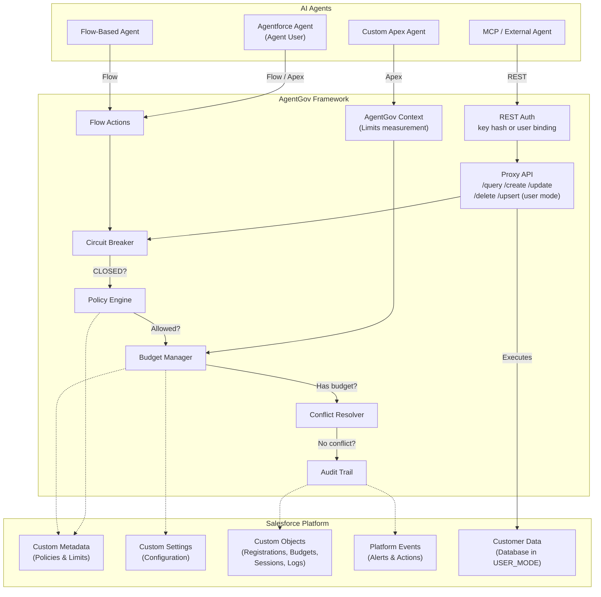
```mermaid
flowchart TB
    subgraph Agents["AI Agents"]
        A1["Agentforce Agent\n(Agent User)"]
        A2["MCP / External Agent"]
        A3["Custom Apex Agent"]
        A4["Flow-Based Agent"]
    end

    subgraph AgentGov["AgentGov Framework"]
        AUTH["REST Auth\nkey hash or user binding"]
        PROXY["Proxy API\n/query /create /update\n/delete /upsert (user mode)"]
        CTX["AgentGov Context\n(Limits measurement)"]
        INV["Flow Actions"]
        CB["Circuit Breaker"]
        PE["Policy Engine"]
        BM["Budget Manager"]
        CR["Conflict Resolver"]
        AL["Audit Trail"]
    end

    subgraph Platform["Salesforce Platform"]
        MD["Custom Metadata\n(Policies & Limits)"]
        CS["Custom Settings\n(Configuration)"]
        CO["Custom Objects\n(Registrations, Budgets,\nSessions, Logs)"]
        EVT["Platform Events\n(Alerts & Actions)"]
        SF["Customer Data\n(Database in USER_MODE)"]
    end

    A2 -->|"REST"| AUTH
    AUTH --> PROXY
    A1 -->|"Flow / Apex"| INV
    A3 -->|"Apex"| CTX
    A4 -->|"Flow"| INV

    PROXY --> CB
    INV --> CB
    CTX --> BM
    CB -->|"CLOSED?"| PE
    PE -->|"Allowed?"| BM
    BM -->|"Has budget?"| CR
    CR -->|"No conflict?"| AL

    PROXY -->|"Executes"| SF
    PE -.-> MD
    BM -.-> MD
    BM -.-> CS
    AL -.-> CO
    AL -.-> EVT
```

### Request Lifecycle

Every agent action follows this pipeline:

1. **Authentication** -- Who is calling? An API key hash in the `X-AgentGov-Key` header, or the Salesforce user bound to the registration.
2. **Registry Check** -- Is the agent registered and active?
3. **Circuit Breaker** -- Is the agent's circuit breaker CLOSED (healthy)?
4. **Policy Evaluation** -- May this agent type perform this operation on this object, with these fields, on this many records?
5. **Conflict Detection** -- Is another agent in this same transaction already modifying this record?
6. **Budget Check** -- Does the agent have remaining governor budget for today?
7. **Action Logging** -- Record the outcome, including denials, via platform events.

If any step fails, the request is denied with a specific error code and a correlation id. The agent is never left guessing about _why_ it was blocked.

---

## Security model

AgentGov targets API 67.0 (Summer '26), where database operations run in user mode by default. The framework decides the access mode for every code path instead of relying on that default:

| Code path                                                            | Sharing           | Access mode   | Why                                                                                                                                                                      |
| -------------------------------------------------------------------- | ----------------- | ------------- | ------------------------------------------------------------------------------------------------------------------------------------------------------------------------ |
| Framework records (registrations, budgets, sessions, logs, policies) | `without sharing` | `SYSTEM_MODE` | Bookkeeping must succeed whoever triggered the action. The user an agent runs as needs no access to AgentGov objects, only the `AgentGov_Agent` permission set.          |
| Operations on the agent's behalf (the proxy)                         | `with sharing`    | `USER_MODE`   | The calling user's object permissions, field-level security, and sharing rules apply to customer data. Queries are compiled from structured input; SOQL text is refused. |
| Dashboards                                                           | `with sharing`    | `USER_MODE`   | People see only what they may see.                                                                                                                                       |

API keys are stored only as SHA-256 hashes. REST errors never include exception text; they carry a correlation id that an administrator can look up in the action log.

---

## Key Features

### 1. Governor Budget Management

Track and enforce daily limits on API calls, SOQL queries, and DML operations per agent. Budgets reset automatically at midnight. Configurable warning (80%), throttle (90%), and block (95%) thresholds fire real-time alerts as agents approach their limits. Exactly one budget row exists per agent per day, even under concurrent first-of-day requests.

### 2. Circuit Breaker Pattern

Automatically disable misbehaving agents using the industry-standard circuit breaker pattern. After a configurable number of failures, the breaker trips to OPEN state, blocking all requests. After a cooldown period, it transitions to HALF_OPEN and admits exactly one probe request. A successful probe closes the breaker; a failure re-opens it with a doubled cooldown, capped at one day.

### 3. Policy Engine

Declarative, metadata-driven access control. Define which agent types can perform which operations on which objects -- all through Custom Metadata Type records. Supports wildcards, field-level restrictions, and per-transaction record limits, all enforced by the proxy. No code changes required to add or modify policies.

### 4. Conflict Resolution

Detect and resolve conflicts when multiple agents attempt to modify the same record. Uses in-memory record locking with priority-based resolution. Higher-priority agents can override lower-priority locks. All conflicts are logged with severity levels for post-incident analysis.

**Scope:** the lock table lives for one Apex transaction, so this catches agents that collide inside a single request, such as a Flow that fans out to several agents, or a proxy call that touches a record another agent in the same transaction already claimed. Two agents arriving in two separate REST calls are two separate transactions and will not collide. Cross-transaction locking is on the roadmap for v2.0.

### 5. Real-Time Monitoring and Alerts

Platform Events (`AgentGov_Alert__e` and `AgentGov_Action_Event__e`) provide real-time visibility into agent activity. The Lightning dashboards subscribe to them and refresh live. Alerts are emailed to the address in AgentGov Settings. Every budget threshold crossing, circuit breaker trip, and policy violation fires an event.

### 6. Governed Proxy API (Dynamic Tracking)

Instead of agents calling the Salesforce REST API directly (which AgentGov can't track), agents go through the **Proxy API**, which performs queries and CRUD on their behalf in user mode. Budget is consumed by the **actual number of records** affected -- not a hardcoded 1.

```bash
# Create 3 Lead records through the proxy → budget consumed by 3 DML operations
curl -X POST "$INSTANCE/services/apexrest/agentgov-proxy/create" \
  -H "Authorization: Bearer $TOKEN" -H "X-AgentGov-Key: $AGENT_KEY" -H "Content-Type: application/json" \
  -d '{"objectName":"Lead","records":[
    {"FirstName":"John","LastName":"Doe","Company":"Acme"},
    {"FirstName":"Jane","LastName":"Smith","Company":"Globex"},
    {"FirstName":"Bob","LastName":"Jones","Company":"Initech"}
  ]}'
```

Reads take a structured request, never SOQL text:

```bash
curl -X POST "$INSTANCE/services/apexrest/agentgov-proxy/query" \
  -H "Authorization: Bearer $TOKEN" -H "X-AgentGov-Key: $AGENT_KEY" -H "Content-Type: application/json" \
  -d '{"objectName":"Lead","fields":["Id","Name","Status"],
       "where":[{"field":"Status","op":"=","value":"Open"}],
       "orderBy":{"field":"Name","direction":"ASC"},"limit":50}'
```

Proxy endpoints: `/query`, `/create`, `/update`, `/delete`, `/upsert`. Each runs the full governance pipeline (circuit breaker → policy → conflict → field-level security → budget) before executing.

For Apex agents, use `AgentGovContext` to measure actual resource consumption via the `Limits` class:

```apex
AgentGovContext.startTracking(agentId);
// ... agent performs SOQL queries, DML operations, callouts ...
AgentGovBudgetManager.BudgetResult result = AgentGovContext.stopTracking();
// Budget consumed by the measured delta, not a self-reported estimate
```

### 7. Flow-Native Integration

Five bulk-safe invocable actions make AgentGov accessible from any Salesforce Flow -- no Apex required:

- **Register Agent Action** -- Check circuit breaker, policy, and budget, then log the action in one call
- **Check Agent Budget** -- Read-only budget status check
- **Get Agent Status** -- Health and circuit breaker state
- **Log Agent Action** -- Record an action for audit
- **Report Agent Usage** -- Charge the resources a Flow actually used

---

## How Budget Tracking Works

AgentGov provides **three ways** to track agent resource consumption. Choose the right one based on your agent type:

| Option                   | Best For               | Accuracy                                      | How It Works                                                                                         |
| ------------------------ | ---------------------- | --------------------------------------------- | ---------------------------------------------------------------------------------------------------- |
| **Proxy API**            | External / MCP agents  | **Exact** — counts actual records             | AgentGov executes the query or DML on behalf of the agent and counts the records processed           |
| **AgentGovContext**      | Apex agents (same org) | **Transaction-level** — measures Limits delta | Captures `Limits.getQueries()` and `Limits.getDMLStatements()` before and after your agent code runs |
| **/authorize + /report** | Any agent type         | **Agent-reported** with reconciliation        | Agent pre-declares expected cost, then optionally reports actual consumption afterward               |

### Option 1: Proxy API (Recommended for External Agents)

The agent calls AgentGov's proxy endpoints instead of Salesforce's standard REST API. AgentGov performs the operation in the calling user's context and knows exactly how many records were affected.

**Why it's the most accurate:** AgentGov controls the DML. There's no way for the agent to do more or fewer operations than what's tracked, and there is no way to read or write anything the calling user could not.

### Option 2: AgentGovContext (Recommended for Apex Agents)

Wrap your agent's Apex code between `startTracking()` and `stopTracking()`. AgentGov measures the actual SOQL queries, DML statements, and callouts consumed using Salesforce's `Limits` class.

```apex
AgentGovContext.startTracking(agentId);

List<Lead> leads = [SELECT Id, Status FROM Lead WHERE Status = 'Open'];  // 1 SOQL
for (Lead l : leads) { l.Status = 'Working'; }
update leads;                                                             // 1 DML
insert new Task(Subject = 'Follow up on leads');                          // 1 DML

AgentGovBudgetManager.BudgetResult result = AgentGovContext.stopTracking();
// Measured: 1 SOQL query + 2 DML operations consumed from budget
```

**Or use the convenience wrapper:**

```apex
AgentGovContext.executeGoverned(agentId, new MyAgentAction());
// Charges the measured usage; if the action throws, the exception propagates after the charge
```

Contexts nest: an inner context's usage is charged to its own agent and excluded from the outer one.

**Important:** This measures everything between start and stop -- including triggers and automations that fire as a result of the agent's DML. This is by design: if an agent's insert triggers three automations, that's the agent's true cost to the org.

### Option 3: /authorize + /report (Flexible, Any Agent Type)

The agent asks permission before acting, then optionally reports what it actually did.

```bash
# Step 1: Pre-authorize (agent declares expected cost)
curl -X POST "$INSTANCE/services/apexrest/agentgov/authorize" \
  -H "Authorization: Bearer $TOKEN" -H "X-AgentGov-Key: $AGENT_KEY" -H "Content-Type: application/json" \
  -d '{"objectName":"Lead","operation":"Update","amount":10}'
# Budget consumed: 10 DML operations (pre-authorized)

# Step 2: Agent does its actual work
# ... agent updates 7 leads ...

# Step 3: Report actual usage (reconciliation)
curl -X POST "$INSTANCE/services/apexrest/agentgov/report" \
  -H "Authorization: Bearer $TOKEN" -H "X-AgentGov-Key: $AGENT_KEY" -H "Content-Type: application/json" \
  -d '{"actual":{"dmlOperations":7},"preAuthorized":{"dmlOperations":10},"success":true}'
# Used 7 of the 10 pre-authorized: nothing further is charged.
# Had it used 12, the extra 2 would be charged now.
```

**Note:** If `amount` is omitted from `/authorize`, it defaults to `1`. The `/report` step is optional but recommended: it charges any usage beyond the pre-authorized amount and reports the outcome to the circuit breaker. Unused pre-authorization is not refunded, because both figures come from the agent and the framework cannot verify them.

---

## Screenshots

> Captured against a v1.1 scratch org. Two of them show an **API Key** column holding a
> readable key, which is what v1.1 stored. From v1.2 that field is cleared on first use and
> only a SHA-256 hash and a short identifying prefix are kept, so the same page now shows
> `API Key Prefix` instead. The sample keys pictured are the fictional ones in
> `AgentGovSampleData`, not credentials for any real org.

### AgentGov Dashboard — Summary Cards, Budget Usage & Active Sessions

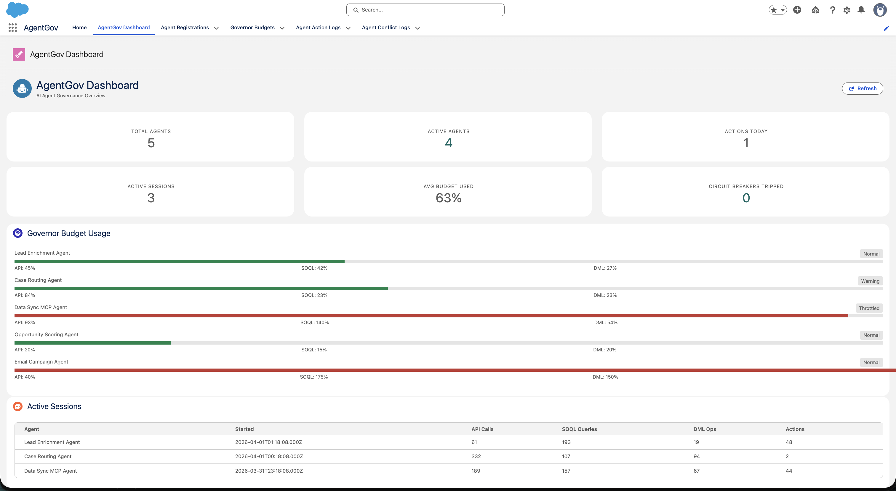

### Agent Health Monitor, Budget Allocation & Conflicts

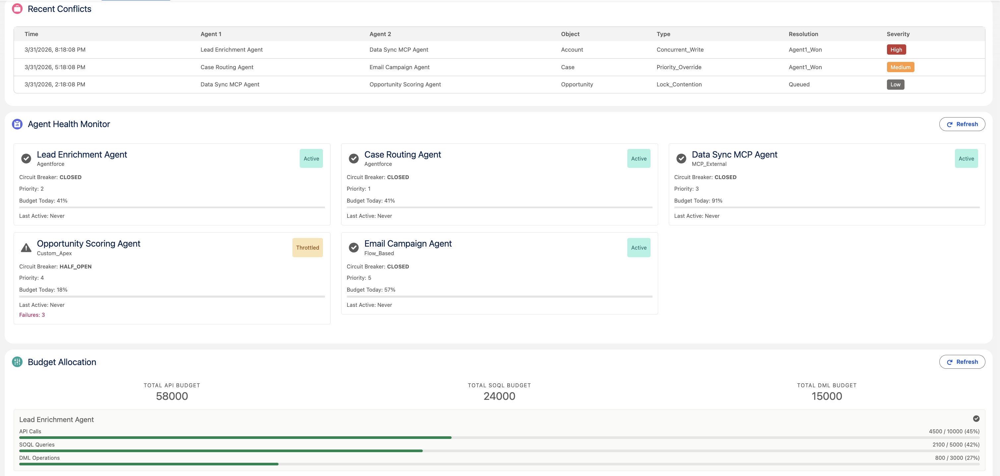

### Detailed Budget Breakdown per Agent & Conflict Log

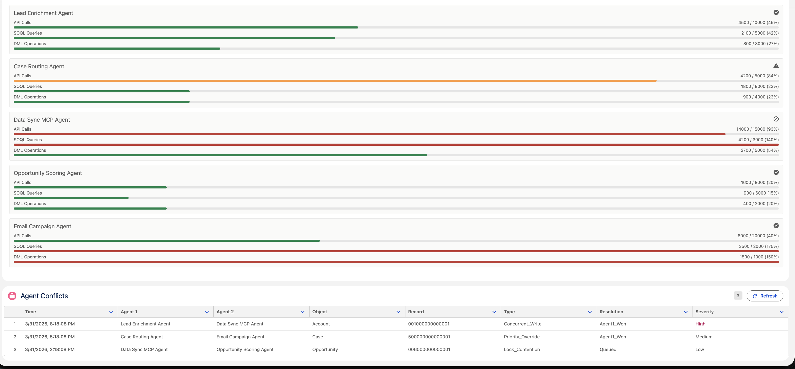

### Agent Registrations

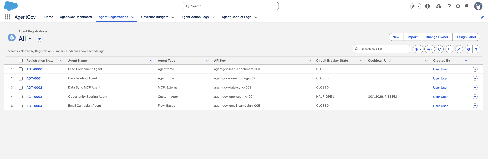

### Agent Registration Detail

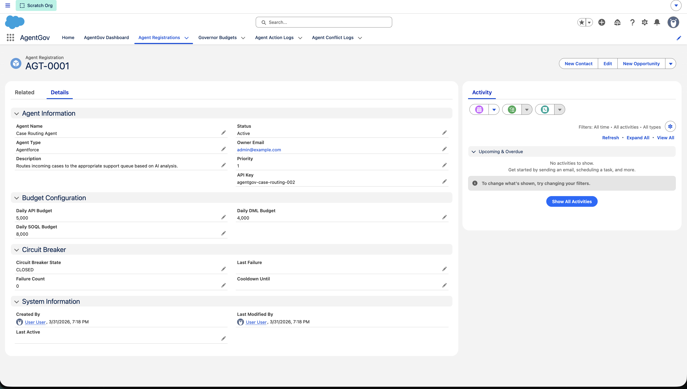

### Governor Budgets

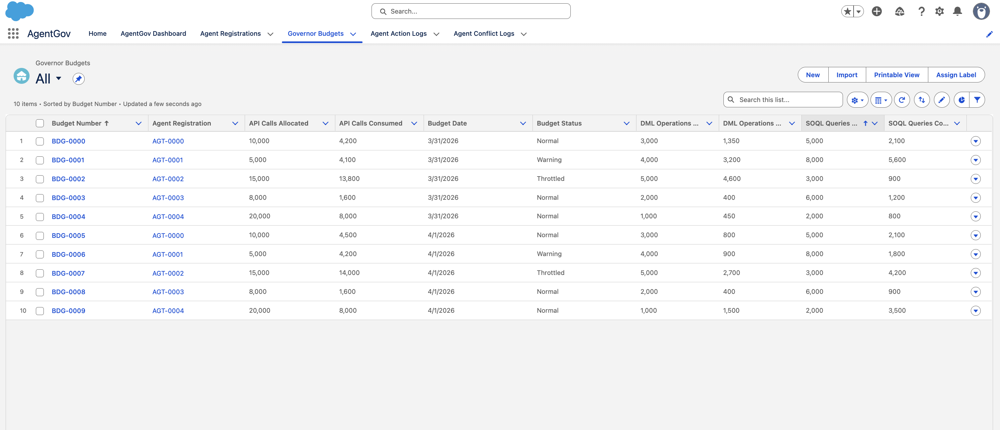

### Agent Action Logs

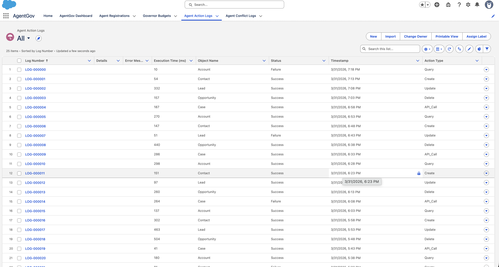

### Agent Conflict Logs

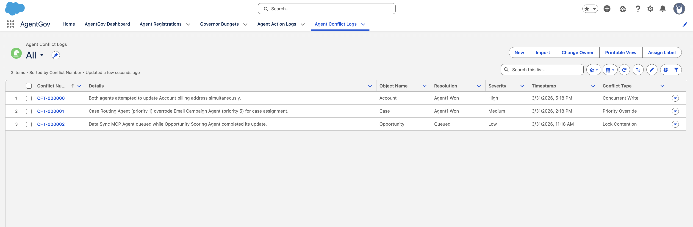

---

## Quick Start

### Step 1: Deploy to your org

```bash
sf project deploy start --source-dir force-app
```

### Step 2: Assign permissions

```bash
# Administrators: full access plus the dashboards
sf org assign permset --name AgentGov_Admin
# Or the group that bundles Admin and User
sf org assign permset --name AgentGov_Operators
```

### Step 3: Register your first agent

```apex
AgentGov_Registration__c agent = AgentGovRegistryService.registerAgent(
    'Lead Enrichment Agent',
    'Agentforce',
    'Enriches leads with firmographic data from external APIs',
    null,                          // no key yet
    'owner@example.com'
);
String apiKey = AgentGovRegistryService.issueApiKey(agent.Id);   // shown once; only its hash is stored
AgentGovRegistryService.activateAgent(agent.Id);
```

For an agent that runs as its own Salesforce user (an Agentforce Agent User or an integration user), bind the user instead of issuing a key:

```apex
AgentGovRegistryService.bindAgentUser(agent.Id, agentUserId);
```

---

## Installation

### Prerequisites

- Salesforce CLI (`sf`) installed -- [Install Guide](https://developer.salesforce.com/tools/salesforcecli)
- A Salesforce org on Summer '26 or later (scratch org, sandbox, or Developer Edition)
- System Administrator profile or equivalent permissions

### Deploy via Salesforce CLI

```bash
git clone https://github.com/himanshupalerwal/salesforce-agent-governance.git
cd salesforce-agent-governance

sf project deploy start --source-dir force-app
sf org assign permset --name AgentGov_Admin

# (Optional) Load sample data
sf apex run --file scripts/setup/load-sample-data.apex
```

### Deploy to a Scratch Org

```bash
sf org create scratch --definition-file config/project-scratch-def.json --alias agentgov-dev --duration-days 30 --set-default
sf project deploy start --source-dir force-app --target-org agentgov-dev
sf org assign permset --name AgentGov_Admin --target-org agentgov-dev
sf apex run --file scripts/setup/load-sample-data.apex --target-org agentgov-dev
sf org open --target-org agentgov-dev
```

The scratch org definition enables Agentforce so agents can be built and tested alongside the framework.

### Upgrading from v1.1

1. If your org ever produced duplicate daily budget rows, run `scripts/migrate/dedupe-budgets.apex` **before** deploying; v1.2 adds a unique key that cannot deploy over duplicates.
2. Deploy v1.2.
3. Run `scripts/migrate/hash-api-keys.apex` to move any remaining plaintext API keys to hashed storage (keys are also upgraded automatically the first time each agent connects).
4. Move REST clients from `apiKey` in the body to the `X-AgentGov-Key` header, and from raw SOQL to the structured `/query` request. See `CHANGELOG.md` for every behavior change.

---

## Usage Examples

### Registering an Agent

```apex
AgentGov_Registration__c agent = AgentGovRegistryService.registerAgent(
    'Case Routing Agent',           // Agent name
    'Agentforce',                   // Type: Agentforce, MCP_External, Custom_Apex, Flow_Based
    'Routes cases to the best available support rep based on skills and workload',
    null,                           // API key: null to issue one later, or a key of your choosing (stored hashed)
    'support-team@example.com'      // Owner email for alerts
);

AgentGovRegistryService.activateAgent(agent.Id);

AgentGov_Session__c session = AgentGovRegistryService.startSession(agent.Id);
// ... agent performs its work ...
AgentGovRegistryService.endSession(session.Id);
```

### Checking Budget Before an Action

```apex
AgentGovBudgetManager.BudgetResult budget = AgentGovBudgetManager.checkBudget(agentId);

if (budget.allowed) {
    // budget.budgetStatus, budget.apiCallsRemaining, budget.soqlQueriesRemaining, budget.dmlOperationsRemaining
} else {
    // The budget is Blocked or Exhausted on at least one limit type
}

// Consume budget when the agent performs an action
AgentGovBudgetManager.BudgetResult result = AgentGovBudgetManager.consumeBudget(
    agentId,
    'API_Calls',  // Limit type: API_Calls, SOQL_Queries, DML_Operations
    1             // Amount to consume
);
```

### Full Authorization Pipeline (Apex)

```apex
Id agentId = ...;
String objectName = 'Lead';
String operation = 'Update';
Id recordId = ...;

if (!AgentGovCircuitBreaker.allowRequest(agentId)) {
    return; // circuit breaker OPEN
}

AgentGovPolicyEngine.PolicyResult policy = AgentGovPolicyEngine.evaluatePolicy(agentId, objectName, operation);
if (!policy.allowed) {
    return; // policy.denialReason explains why
}
AgentGovPolicyEngine.assertFieldsAllowed(policy, new Set<String>{ 'Status', 'Rating' });

AgentGovConflictResolver.assertNoConflict(agentId, recordId, objectName);

try {
    AgentGovBudgetManager.consumeBudget(agentId, 'DML_Operations', 1);
} catch (AgentGovException e) {
    return; // BUDGET_EXCEEDED
}

// ... perform the action ...
AgentGovCircuitBreaker.recordSuccess(agentId);
```

### Using the REST API (for MCP and External Agents)

#### Register an Agent

```bash
curl -X POST "$INSTANCE/services/apexrest/agentgov/register" \
  -H "Authorization: Bearer $ACCESS_TOKEN" -H "Content-Type: application/json" \
  -d '{
    "agentName": "Lead Enrichment Agent",
    "agentType": "MCP_External",
    "description": "Enriches leads with firmographic data",
    "ownerEmail": "data-team@example.com"
  }'
```

**Response (201):**

```json
{
  "success": true,
  "correlationId": "4c0f...",
  "registrationId": "a0B...",
  "registrationNumber": "AGT-0001",
  "status": "Inactive",
  "apiKey": "agk_...",
  "apiKeyPrefix": "agk_5e2a9c1d",
  "message": "Agent registered. Store the apiKey now; only its hash is kept and it cannot be retrieved later. Activate the agent to enable it."
}
```

#### Authorize an Action

```bash
curl -X POST "$INSTANCE/services/apexrest/agentgov/authorize" \
  -H "Authorization: Bearer $ACCESS_TOKEN" -H "X-AgentGov-Key: $AGENT_KEY" -H "Content-Type: application/json" \
  -d '{"objectName": "Lead", "operation": "Update", "recordId": "00Q..."}'
```

**Response (200):**

```json
{
  "success": true,
  "correlationId": "4c0f...",
  "authorized": true,
  "agentId": "a0B...",
  "budgetStatus": "Normal",
  "remainingBudget": { "apiCalls": 9842, "soqlQueries": 4991, "dmlOperations": 2987 },
  "conflict": { "detected": false, "resolution": null }
}
```

#### Check Budget and Health

```bash
curl "$INSTANCE/services/apexrest/agentgov/budget/a0B..." -H "Authorization: Bearer $ACCESS_TOKEN" -H "X-AgentGov-Key: $AGENT_KEY"
curl "$INSTANCE/services/apexrest/agentgov/health/a0B..." -H "Authorization: Bearer $ACCESS_TOKEN" -H "X-AgentGov-Key: $AGENT_KEY"
```

An agent may read its own budget and health. Reading another agent requires the `AgentGov_Admin_Access` custom permission.

### Using Invocable Actions in Flow

AgentGov ships with five invocable actions that appear in the Flow Builder under the **AgentGov** category. All of them are bulk-safe.

#### Register Agent Action (All-in-One)

```
Flow Element: Action — "Register Agent Action"
Input:
  - Agent Registration ID: {!varAgentId}
  - Action Type: "Update"
  - Object Name: "Case"
  - Record ID: {!$Record.Id}

Output:
  - Authorized → {!varAuthorized}      (Boolean)
  - Budget Status → {!varBudgetStatus}  (Text)
  - Denial Reason → {!varDenialReason}  (Text)
```

#### Check Agent Budget

```
Flow Element: Action — "Check Agent Budget"
Input:  Agent Registration ID
Output: Has Budget, Budget Status, API Calls Remaining, SOQL Queries Remaining, DML Operations Remaining, Error Message
```

#### Get Agent Status

```
Flow Element: Action — "Get Agent Status"
Input:  Agent Registration ID
Output: Agent Name, Agent Status, Circuit Breaker State, Is Healthy, Failure Count, Error Message
```

#### Log Agent Action

Records an action for audit purposes without running governance checks. Use it when the checks have already been made separately, or for informational events.

#### Report Agent Usage

```
Flow Element: Action — "Report Agent Usage"
Input:  Agent Registration ID, API Calls Used, SOQL Queries Used, DML Statements Used
Output: Budget Status, Budget Allowed, API Calls Remaining, SOQL Queries Remaining, DML Operations Remaining, Error Message
```

See [docs/flow-integration.md](docs/flow-integration.md) for patterns.

---

## REST API Reference

| Method | Endpoint                                              | Description                                             |
| ------ | ----------------------------------------------------- | ------------------------------------------------------- |
| `POST` | `/services/apexrest/agentgov/register`                | Register a new agent; returns a generated key once      |
| `POST` | `/services/apexrest/agentgov/authorize`               | Authorize an agent action and pre-charge budget         |
| `POST` | `/services/apexrest/agentgov/report`                  | Report actual resource consumption and reconcile        |
| `POST` | `/services/apexrest/agentgov/rotate-key`              | Issue a replacement API key                             |
| `GET`  | `/services/apexrest/agentgov/budget/{registrationId}` | Get current budget status                               |
| `GET`  | `/services/apexrest/agentgov/health/{registrationId}` | Get agent health and circuit breaker state              |
| `POST` | `/services/apexrest/agentgov-proxy/query`             | Structured query in user mode (counts as 1 SOQL budget) |
| `POST` | `/services/apexrest/agentgov-proxy/create`            | Insert records (budget = record count)                  |
| `POST` | `/services/apexrest/agentgov-proxy/update`            | Update records (budget = record count)                  |
| `POST` | `/services/apexrest/agentgov-proxy/delete`            | Delete records (budget = record count)                  |
| `POST` | `/services/apexrest/agentgov-proxy/upsert`            | Upsert records (budget = record count)                  |

All endpoints require a Salesforce OAuth bearer token from a user with the `AgentGov_Agent` permission set. Every endpoint except `/register` also requires an agent identity: the `X-AgentGov-Key` header, or a Salesforce user bound to the registration through `Agent_User__c`. `apiKey` in the body still works but is deprecated.

**Error Response Format:**

```json
{
  "success": false,
  "errorCode": "BUDGET_EXCEEDED",
  "message": "Governor budget exceeded for limit type: DML_Operations",
  "correlationId": "4c0f...",
  "timestamp": "2026-09-15T10:00:00.000Z"
}
```

**Error Codes:**

| Code                    | HTTP Status | Description                                                          |
| ----------------------- | ----------- | -------------------------------------------------------------------- |
| `INVALID_INPUT`         | 400         | Missing or invalid request parameters, unknown object or field       |
| `AGENT_NOT_FOUND`       | 404         | No credential resolved to a registration                             |
| `AGENT_NOT_ACTIVE`      | 403         | Agent exists but is not in Active status                             |
| `ACCESS_DENIED`         | 403         | The calling user lacks access to the data, or may not read the agent |
| `POLICY_VIOLATION`      | 403         | Denied by policy, a restricted field, or a record cap                |
| `BUDGET_EXCEEDED`       | 429         | Daily governor budget blocked or exhausted                           |
| `MAX_CONCURRENT_AGENTS` | 429         | Org has reached the max concurrent agent limit                       |
| `RECORD_LOCKED`         | 409         | Record is locked by a higher-priority agent                          |
| `CIRCUIT_BREAKER_OPEN`  | 503         | Agent is temporarily disabled                                        |
| `INTERNAL_ERROR`        | 500         | Unexpected failure; details are logged under the correlation id      |

Full details in [docs/rest-api-reference.md](docs/rest-api-reference.md).

---

## Configuration

### AgentGov_Settings__c (Custom Settings -- Hierarchy)

| Field                                  | Type     | Default | Description                                                                           |
| -------------------------------------- | -------- | ------- | ------------------------------------------------------------------------------------- |
| `Is_Enabled__c`                        | Checkbox | `true`  | Master kill switch for the entire framework                                           |
| `Default_Agent_Priority__c`            | Number   | `5`     | Default priority for new agents (1 = highest)                                         |
| `Max_Concurrent_Agents__c`             | Number   | `10`    | Maximum agents in Active status simultaneously                                        |
| `Circuit_Breaker_Failure_Threshold__c` | Number   | `5`     | Failures before circuit breaker trips to OPEN                                         |
| `Circuit_Breaker_Cooldown_Minutes__c`  | Number   | `30`    | Minutes before an OPEN breaker admits a probe (doubles on re-trip, capped at one day) |
| `Log_Retention_Days__c`                | Number   | `90`    | Days to retain action log records                                                     |
| `Enable_Conflict_Detection__c`         | Checkbox | `true`  | Enable/disable in-memory conflict detection                                           |
| `Enable_Real_Time_Events__c`           | Checkbox | `true`  | Enable/disable platform event publishing                                              |
| `Admin_Notification_Email__c`          | Email    | (none)  | Recipient of alert emails; leave blank to send none                                   |

### AgentGov_Limit_Config__mdt (Custom Metadata Type)

| Field                     | Type     | Description                                                   |
| ------------------------- | -------- | ------------------------------------------------------------- |
| `Limit_Type__c`           | Text     | `API_Calls`, `SOQL_Queries`, or `DML_Operations`              |
| `Warning_Threshold__c`    | Percent  | Usage percentage that triggers a warning alert (default: 80%) |
| `Throttle_Threshold__c`   | Percent  | Usage percentage that triggers throttling (default: 90%)      |
| `Block_Threshold__c`      | Percent  | Usage percentage that blocks the agent (default: 95%)         |
| `Default_Daily_Budget__c` | Number   | Default daily allocation for this limit type                  |
| `Is_Active__c`            | Checkbox | Whether this configuration is active                          |

### AgentGov_Policy__mdt (Custom Metadata Type)

| Field                            | Type     | Description                                                                                             |
| -------------------------------- | -------- | ------------------------------------------------------------------------------------------------------- |
| `Agent_Type__c`                  | Text     | Agent type this policy applies to (`Agentforce`, `MCP_External`, `Custom_Apex`, `Flow_Based`, or `All`) |
| `Object_Name__c`                 | Text     | Salesforce object API name, or `*` for all objects                                                      |
| `Operation__c`                   | Text     | Operation type (`Query`, `Create`, `Update`, `Delete`, `Upsert`, `API_Call`, `Flow_Trigger`, or `*`)    |
| `Is_Allowed__c`                  | Checkbox | Whether this action is allowed (explicit deny overrides allow)                                          |
| `Field_Restrictions__c`          | Text     | Comma-separated field API names the agent may neither read nor write through the proxy                  |
| `Max_Records_Per_Transaction__c` | Number   | Maximum records per proxy request; also caps `/query` results                                           |
| `Description__c`                 | Text     | Human-readable description of the policy intent                                                         |

---

## Circuit Breaker State Machine

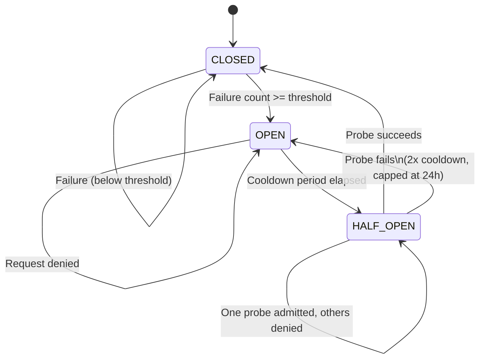
```mermaid
stateDiagram-v2
    [*] --> CLOSED

    CLOSED --> CLOSED : Success
    CLOSED --> CLOSED : Failure (below threshold)
    CLOSED --> OPEN : Failure count >= threshold

    OPEN --> OPEN : Request denied
    OPEN --> HALF_OPEN : Cooldown period elapsed

    HALF_OPEN --> HALF_OPEN : One probe admitted, others denied
    HALF_OPEN --> CLOSED : Probe succeeds
    HALF_OPEN --> OPEN : Probe fails\n(2x cooldown, capped at 24h)
```

**Default Configuration:**

- Failure threshold: **5** consecutive failures
- Cooldown period: **30** minutes
- Retry backoff: **2x** multiplier on each re-trip, capped at **24 hours**

The proxy and the Flow actions report outcomes automatically. Agents using `/authorize` report their own by sending `"success": true` or `false` on the following `POST /agentgov/report` call. A successful report from an agent whose breaker is HALF_OPEN closes the breaker and returns it to Active.

---

## Governor Budget Lifecycle

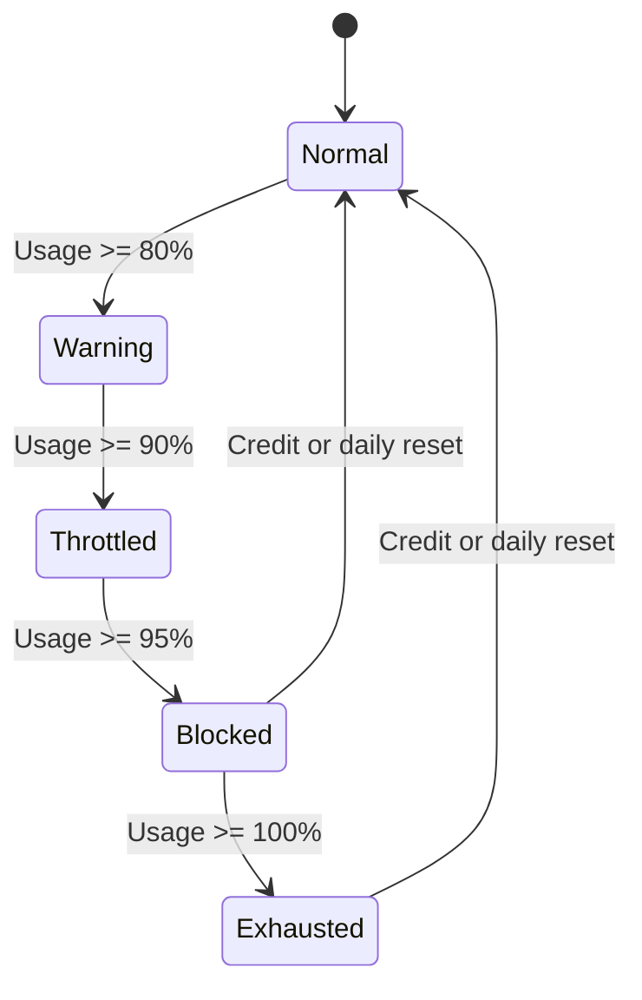
```mermaid
stateDiagram-v2
    [*] --> Normal

    Normal --> Warning : Usage >= 80%
    Warning --> Throttled : Usage >= 90%
    Throttled --> Blocked : Usage >= 95%
    Blocked --> Exhausted : Usage >= 100%

    Blocked --> Normal : Credit or daily reset
    Exhausted --> Normal : Credit or daily reset
```

A budget's status is the most severe status across the three limit types. **Blocked** and **Exhausted** deny every operation until a credit or the daily reset brings usage back down. Consumption that crosses a line is recorded before the denial is returned, so the ledger shows the attempt.

**Budget consumption sources:**

- **Proxy API:** actual record count (create 5 records = 5 DML consumed)
- **AgentGovContext:** measured `Limits` delta
- **`/authorize`:** the `amount` parameter (default 1)
- **`/report`:** post-execution reconciliation, charging only usage beyond the pre-authorized amount. **Report Agent Usage** (Flow) is additive: it charges everything it reports.

**Default Budgets per Agent:** API Calls **10,000** / day, SOQL Queries **5,000** / day, DML Operations **3,000** / day, overridable per registration.

---

## Scheduled Jobs

```apex
// Daily budget reset (run at midnight)
System.schedule('AgentGov Daily Reset', '0 0 0 * * ?', new AgentGovDailyReset());

// Hourly health check (circuit breaker transitions + orphan session cleanup)
System.schedule('AgentGov Health Check', '0 0 * * * ?', new AgentGovHealthCheck());

// Weekly log cleanup (purge old action logs based on retention setting)
System.schedule('AgentGov Cleanup', '0 0 2 ? * SUN', new AgentGovCleanup());
```

---

## Data Model

| Object                       | Type            | Purpose                                                                |
| ---------------------------- | --------------- | ---------------------------------------------------------------------- |
| `AgentGov_Registration__c`   | Custom Object   | Agent registry -- one record per agent, with hashed key and agent user |
| `AgentGov_Session__c`        | Custom Object   | Tracks agent sessions (start/end, resource usage)                      |
| `AgentGov_Budget__c`         | Custom Object   | Daily budget allocations and consumption, one row per agent per day    |
| `AgentGov_Action_Log__c`     | Custom Object   | Audit log of all agent actions, denials, and framework `System` events |
| `AgentGov_Conflict_Log__c`   | Custom Object   | Record of detected and resolved conflicts                              |
| `AgentGov_Settings__c`       | Custom Settings | Org-level framework configuration                                      |
| `AgentGov_Limit_Config__mdt` | Custom Metadata | Governor limit thresholds                                              |
| `AgentGov_Policy__mdt`       | Custom Metadata | Agent access control policies                                          |
| `AgentGov_Alert__e`          | Platform Event  | Real-time budget and circuit breaker alerts                            |
| `AgentGov_Action_Event__e`   | Platform Event  | Real-time action notifications                                         |

Permission sets: `AgentGov_Admin` (administrators), `AgentGov_User` (read-only dashboards), `AgentGov_Agent` (the user an agent runs as), and the `AgentGov_Operators` group.

---

## Project Structure

```
salesforce-agent-governance/
├── .github/               # CI, release, and Dependabot workflows; issue and PR templates
├── config/                # Scratch org definition (Agentforce enabled)
├── docs/                  # Guides and references
├── force-app/main/default/
│   ├── classes/           # Apex services, REST resources, invocables, jobs, tests
│   ├── customMetadata/    # Shipped limit configurations and policies
│   ├── lwc/               # Dashboard components and the shared utility module
│   ├── objects/           # Custom objects, settings, metadata types, platform events
│   ├── permissionsets/    # AgentGov_Admin, AgentGov_User, AgentGov_Agent
│   ├── triggers/          # Platform-event and budget triggers (one line each)
│   └── ...
├── force-app/test/        # Jest mocks for platform modules
├── scripts/
│   ├── migrate/           # One-time upgrade scripts
│   └── setup/             # Scratch org setup and sample data
├── CLAUDE.md              # Conventions for contributors and AI-assisted changes
├── code-analyzer.yml      # Salesforce Code Analyzer configuration
└── sfdx-project.json
```

---

## Documentation

| Guide                                            | What it covers                                           |
| ------------------------------------------------ | -------------------------------------------------------- |
| [Getting Started](docs/getting-started.md)       | Install runbook and the administrator's day-to-day guide |
| [Configuration](docs/configuration-guide.md)     | Every setting, limit config, and policy field            |
| [Architecture](docs/architecture.md)             | Pipeline, state machines, and the security model         |
| [Apex API Reference](docs/api-reference.md)      | Public classes, methods, and error codes                 |
| [REST API Reference](docs/rest-api-reference.md) | Endpoints, request and response shapes                   |
| [Flow Integration](docs/flow-integration.md)     | The five invocable actions and how to wire them          |
| [MCP Integration](docs/mcp-integration-guide.md) | Connecting an external or MCP agent                      |
| [Troubleshooting](docs/troubleshooting.md)       | Symptoms, causes, and fixes                              |
| [FAQ](docs/FAQ.md)                               | Common questions                                         |
| [Roadmap](docs/ROADMAP.md)                       | What is planned and what shipped                         |
| [Security Policy](.github/SECURITY.md)           | Supported versions and how to report a vulnerability     |

---

## Roadmap

The next release, v1.3, makes AgentGov Agentforce-native: action and credit budgets, a governed Agentforce action with a sample Agent Script agent, hosted MCP exposure, and an observability import. See [docs/ROADMAP.md](docs/ROADMAP.md) for the full roadmap and [CHANGELOG.md](CHANGELOG.md) for what shipped.

---

## Contributing

Contributions are welcome. Please read the [Contributing Guide](CONTRIBUTING.md) and the [Code of Conduct](CODE_OF_CONDUCT.md) before submitting a pull request.

1. Fork the repository
2. Create a feature branch (`git checkout -b feature/your-feature`)
3. Write tests (Apex coverage 85% or higher; Jest thresholds enforced)
4. Run `npm run lint`, `npm run prettier:verify`, and `npm run test:unit:coverage`
5. Open a Pull Request

---

## License

This project is licensed under the MIT License. See [LICENSE](LICENSE) for details.

---

## Author

**Himanshu Palerwal**

Questions and contributions are welcome through
[issues and pull requests](https://github.com/himanshupalerwal/salesforce-agent-governance/issues).

---

Built with Salesforce, for Salesforce.
