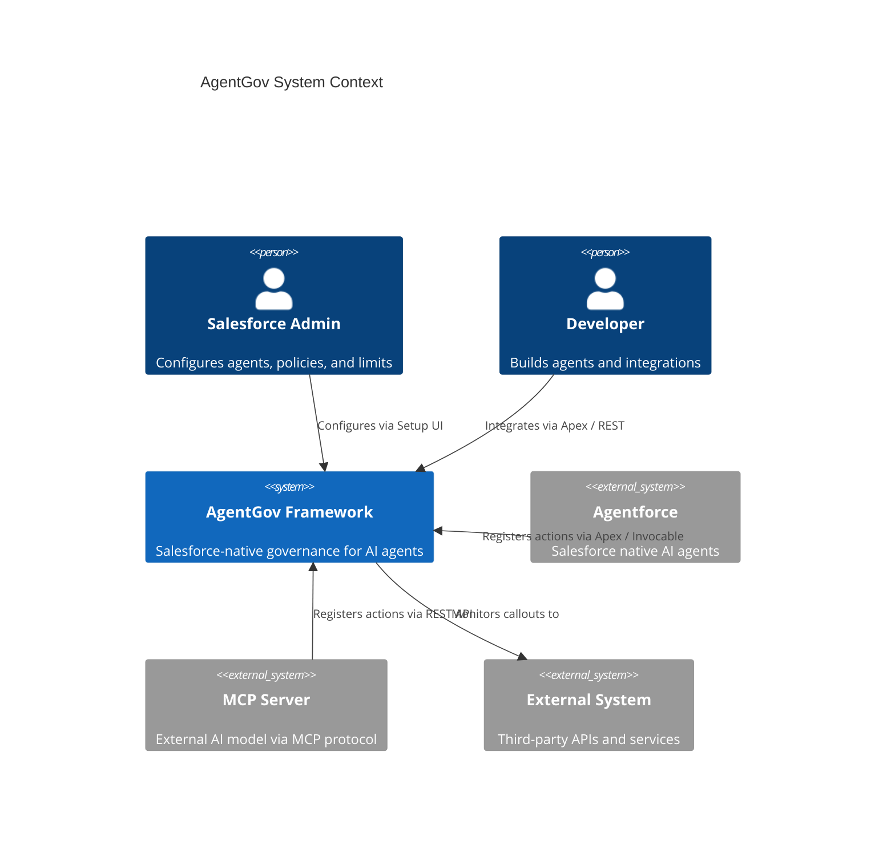
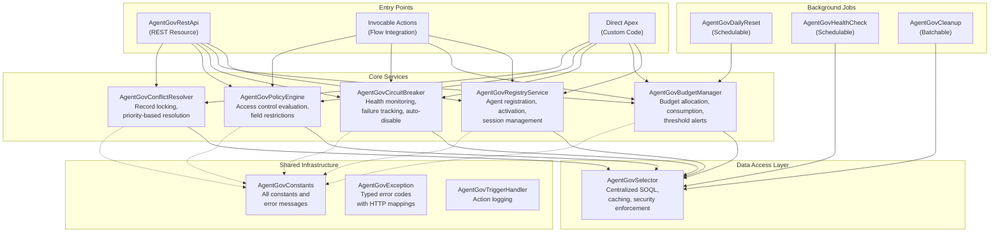
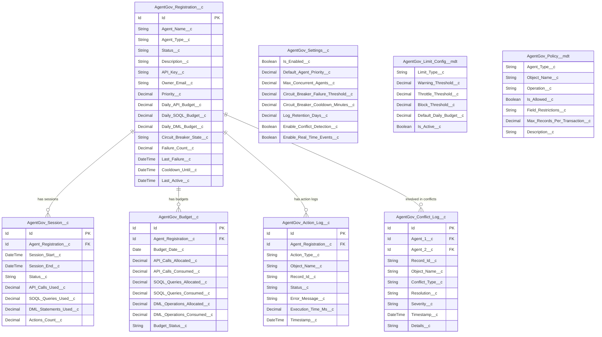
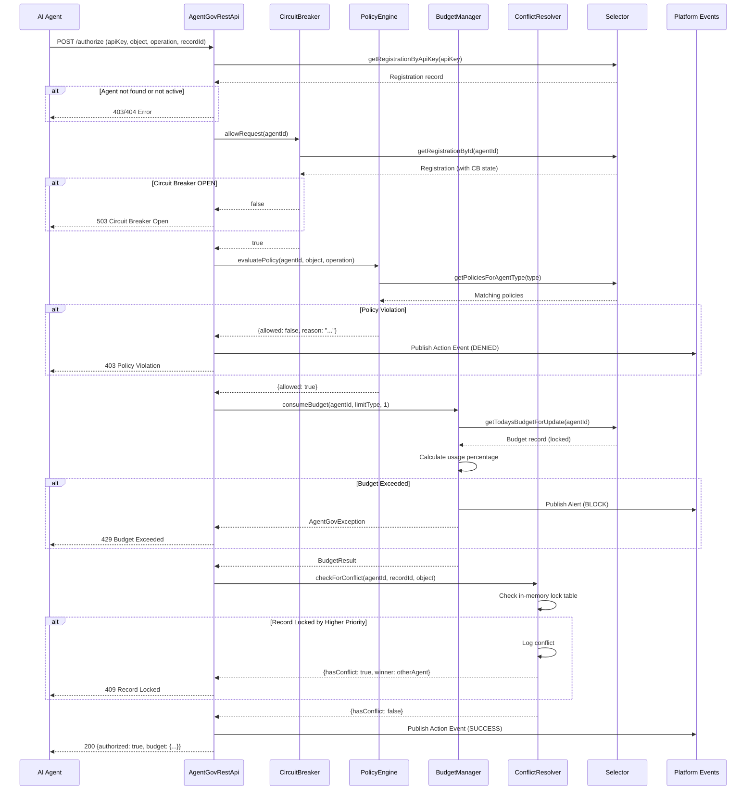
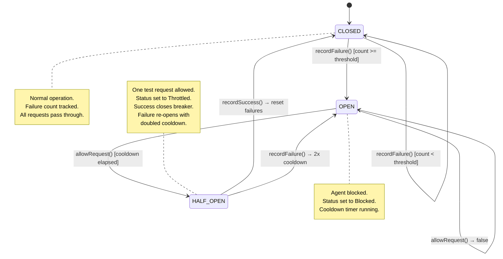

# Architecture Overview

This document describes the architecture of the AgentGov framework, including system context, component design, data model, and request lifecycle.

---

## System Context

---

## Component Diagram

### Component Responsibilities

| Component | Responsibility |
|-----------|---------------|
| **AgentGovRegistryService** | Agent CRUD, activation/deactivation, session lifecycle |
| **AgentGovBudgetManager** | Daily budget creation, consumption tracking, threshold alerts via platform events |
| **AgentGovCircuitBreaker** | CLOSED/OPEN/HALF_OPEN state machine, failure counting, cooldown with exponential backoff |
| **AgentGovPolicyEngine** | Metadata-driven policy evaluation, wildcard matching, field restrictions |
| **AgentGovConflictResolver** | In-memory record locking, priority-based conflict resolution, conflict logging |
| **AgentGovSelector** | All SOQL queries, per-transaction caching, `WITH SECURITY_ENFORCED` |
| **AgentGovRestApi** | REST endpoints for external agent integration |
| **AgentGovConstants** | Centralized string literals, default values, valid type sets |
| **AgentGovException** | Typed exceptions with error codes mapped to HTTP status codes |

---

## Data Model

### Relationships

- **Registration to Session**: One-to-many. Each agent can have many sessions over time, but only one active session at a time.
- **Registration to Budget**: One-to-many. One budget record per agent per day.
- **Registration to Action Log**: One-to-many. Every action performed by an agent creates a log record.
- **Registration to Conflict Log**: Many-to-many via Agent_1__c and Agent_2__c lookup fields.

---

## Request Lifecycle Sequence Diagram

---

## Circuit Breaker State Machine

### State Transitions

| From | To | Trigger | Side Effects |
|------|----|---------|--------------|
| CLOSED | OPEN | `recordFailure()` when `Failure_Count__c >= threshold` | Status set to Blocked, Cooldown_Until__c set, Alert event fired |
| OPEN | HALF_OPEN | `allowRequest()` when `DateTime.now() >= Cooldown_Until__c` | Status set to Throttled |
| HALF_OPEN | CLOSED | `recordSuccess()` | Failure count reset to 0, Status set to Active |
| HALF_OPEN | OPEN | `recordFailure()` | Cooldown doubled (exponential backoff) |

---

## Design Principles

1. **Security First**: All SOQL uses `WITH SECURITY_ENFORCED`. All classes use `with sharing`. FLS is enforced at the selector layer.

2. **Bulkification**: All invocable actions accept and return `List<>`. Budget operations use `FOR UPDATE` to prevent race conditions.

3. **Caching**: The `AgentGovSelector` caches settings, metadata, and registration records per transaction to minimize SOQL consumption.

4. **Fail-Safe Defaults**: If Custom Settings are not configured, sensible defaults are used (from `AgentGovConstants`). If the framework is disabled, all actions are allowed.

5. **Separation of Concerns**: Entry points (REST, Invocable, Apex) are thin wrappers. Business logic lives in service classes. Data access is centralized in the Selector.

6. **Observability**: Platform Events provide real-time visibility. Action Logs and Conflict Logs provide historical audit trails. Budget status is always available via API.
