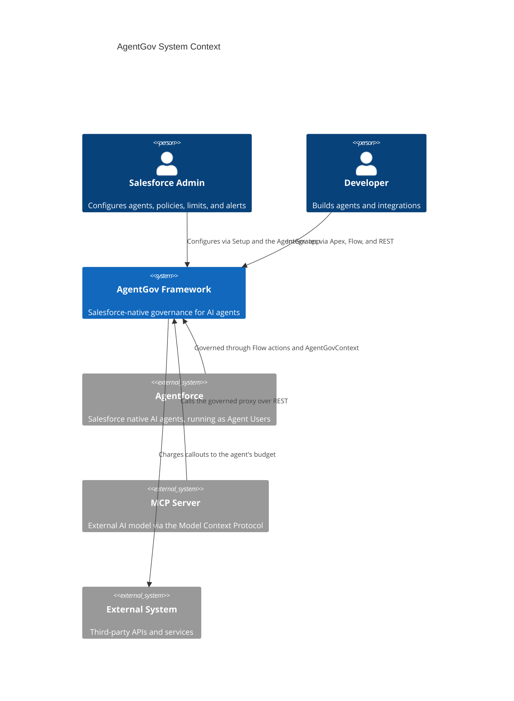
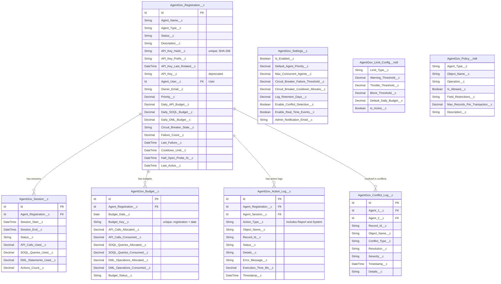
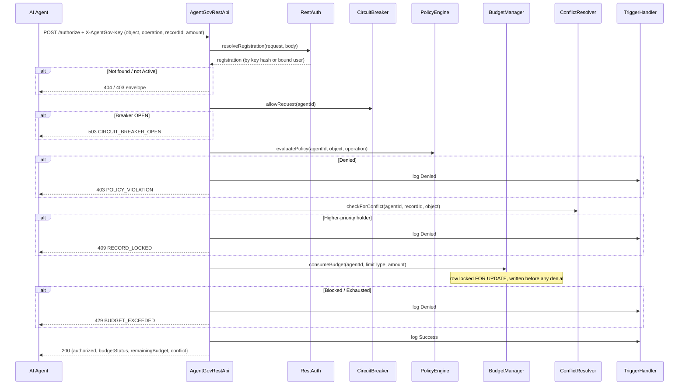
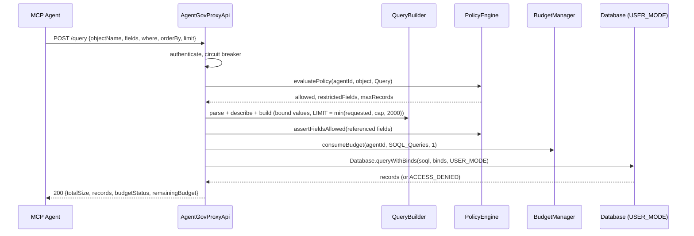
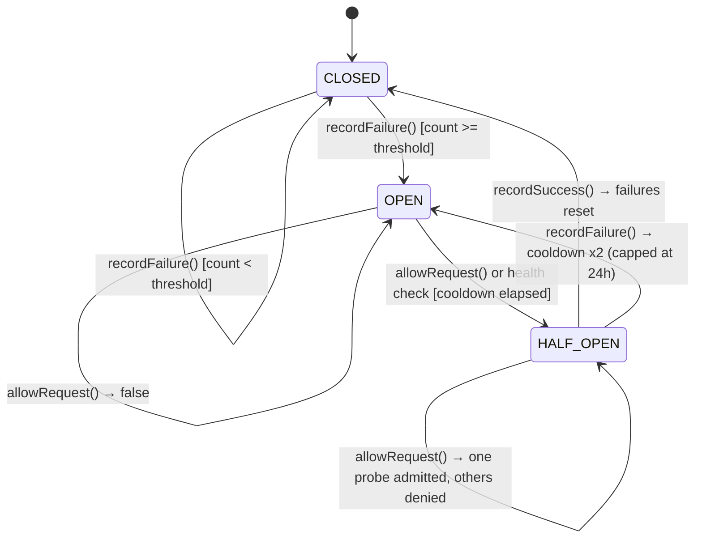

# Architecture Overview

This document describes the architecture of the AgentGov framework: system context,
components and their security posture, the data model, and the request lifecycles.

---

## System Context

```mermaid
C4Context
    title AgentGov System Context

    Person(admin, "Salesforce Admin", "Configures agents, policies, limits, and alerts")
    Person(dev, "Developer", "Builds agents and integrations")

    System(agentgov, "AgentGov Framework", "Salesforce-native governance for AI agents")

    System_Ext(agentforce, "Agentforce", "Salesforce native AI agents, running as Agent Users")
    System_Ext(mcp, "MCP Server", "External AI model via the Model Context Protocol")
    System_Ext(external, "External System", "Third-party APIs and services")

    Rel(admin, agentgov, "Configures via Setup and the AgentGov app")
    Rel(dev, agentgov, "Integrates via Apex, Flow, and REST")
    Rel(agentforce, agentgov, "Governed through Flow actions and AgentGovContext")
    Rel(mcp, agentgov, "Calls the governed proxy over REST")
    Rel(agentgov, external, "Charges callouts to the agent's budget")
```

---

## Security model

Since API version 67.0, database operations run in user mode unless a class says otherwise.
AgentGov makes that decision explicit for every code path:

| Layer                                                                               | Sharing             | Access mode   | Reason                                                                                                                                                                                                                                                         |
| ----------------------------------------------------------------------------------- | ------------------- | ------------- | -------------------------------------------------------------------------------------------------------------------------------------------------------------------------------------------------------------------------------------------------------------- |
| `AgentGovSelector`, `AgentGovDml`, `AgentGovCleanup`                                | `without sharing`   | `SYSTEM_MODE` | The framework's ledger must be readable and writable whoever triggered the action. Agent Users and integration users hold no access to AgentGov objects. Policy metadata is read here too, so a caller without metadata access cannot make policies disappear. |
| `AgentGovProxyApi` (via `AgentGovQueryBuilder`)                                     | `with sharing`      | `USER_MODE`   | Work done on an agent's behalf against customer data respects the calling user's object permissions, field-level security, and sharing.                                                                                                                        |
| `AgentGovDashboardController`                                                       | `with sharing`      | `USER_MODE`   | People see only what they may see.                                                                                                                                                                                                                             |
| Service classes (budget, breaker, policy, registry, context, trigger handler, jobs) | `inherited sharing` | none directly | They touch no data themselves; reads go through the selector, writes through `AgentGovDml`.                                                                                                                                                                    |
| Platform-event triggers                                                             | not declarable      | system        | Platform rule; the handlers write only framework records.                                                                                                                                                                                                      |

REST callers are identified by an API key hash (`X-AgentGov-Key`) or by the Salesforce user
bound to the registration (`Agent_User__c`). Nothing an agent sends is executed as SOQL.

---

## Component Diagram

```mermaid
flowchart TB
    subgraph EntryPoints["Entry Points"]
        REST["AgentGovRestApi\n/register /authorize /report\n/rotate-key /budget /health"]
        PROXY["AgentGovProxyApi\n/query /create /update\n/delete /upsert"]
        CTX["AgentGovContext\n(Limits measurement)"]
        INV["Invocable Actions\n(5 Flow actions)"]
        LWC["Lightning Web Components\n(dashboards)"]
    end

    subgraph RestSupport["REST Support"]
        AUTH["AgentGovRestAuth\nkey hash / user binding"]
        RESP["AgentGovRestResponder\nenvelope, correlation id"]
        QB["AgentGovQueryBuilder\nstructured query → bound SOQL"]
    end

    subgraph CoreServices["Core Services (inherited sharing)"]
        REG["AgentGovRegistryService"]
        BM["AgentGovBudgetManager"]
        CB["AgentGovCircuitBreaker"]
        PE["AgentGovPolicyEngine"]
        CR["AgentGovConflictResolver"]
        TH["AgentGovTriggerHandler\naudit trail, alerts"]
    end

    subgraph DataLayer["Framework Data Layer (system mode)"]
        SEL["AgentGovSelector\nreads + caching"]
        DML["AgentGovDml\nwrites + publish"]
    end

    subgraph UserData["Customer Data (user mode)"]
        DC["AgentGovDashboardController"]
        SF["Database.* with USER_MODE"]
    end

    subgraph Jobs["Background Jobs"]
        DR["AgentGovDailyReset"]
        HC["AgentGovHealthCheck"]
        CL["AgentGovCleanup"]
    end

    REST --> AUTH
    REST --> RESP
    PROXY --> AUTH
    PROXY --> RESP
    PROXY --> QB
    QB --> SF
    PROXY --> SF
    REST --> CB
    REST --> PE
    REST --> BM
    REST --> CR
    PROXY --> CB
    PROXY --> PE
    PROXY --> BM
    PROXY --> CR
    CTX --> BM
    INV --> CB
    INV --> PE
    INV --> BM
    INV --> TH
    LWC --> DC
    REG --> SEL
    REG --> DML
    BM --> SEL
    BM --> DML
    CB --> SEL
    CB --> DML
    PE --> SEL
    CR --> DML
    TH --> DML
    DR --> BM
    HC --> CB
    CL --> DML
```

### Component Responsibilities

| Component                                    | Responsibility                                                                                          |
| -------------------------------------------- | ------------------------------------------------------------------------------------------------------- |
| **AgentGovRegistryService**                  | Registration, activation, key issuance, agent-user binding, session lifecycle                           |
| **AgentGovBudgetManager**                    | Daily budget rows, single and bulk consumption, credits, threshold alerts                               |
| **AgentGovCircuitBreaker**                   | CLOSED/OPEN/HALF_OPEN state machine with a single probe and capped backoff                              |
| **AgentGovPolicyEngine**                     | Metadata-driven evaluation plus enforcement of field restrictions and record caps                       |
| **AgentGovConflictResolver**                 | In-transaction record locks resolved by priority; conflict logging                                      |
| **AgentGovContext**                          | `Limits`-based measurement for Apex agents, with nesting                                                |
| **AgentGovTriggerHandler**                   | Action events to log rows, rejected-row recovery, alert emails, framework `System` entries, budget keys |
| **AgentGovSelector**                         | All framework reads in system mode, cached per transaction                                              |
| **AgentGovDml**                              | All framework writes in system mode, with result inspection                                             |
| **AgentGovRestApi**                          | Governance endpoints                                                                                    |
| **AgentGovProxyApi**                         | Governed CRUD and query on the agent's behalf, in user mode                                             |
| **AgentGovRestAuth**                         | Credential resolution, key hashing, owner-or-admin guard                                                |
| **AgentGovRestResponder**                    | Response envelope and correlation ids; internal errors logged, never echoed                             |
| **AgentGovQueryBuilder**                     | Structured query validation and compilation with typed binds                                            |
| **AgentGovDashboardController**              | User-mode reads for the Lightning components                                                            |
| **AgentGovConstants**, **AgentGovException** | Vocabulary and typed errors mapped to HTTP status codes                                                 |

---

## Data Model

```mermaid
erDiagram
    AgentGov_Registration__c {
        Id Id PK
        String Agent_Name__c
        String Agent_Type__c
        String Status__c
        String Description__c
        String API_Key_Hash__c "unique, SHA-256"
        String API_Key_Prefix__c
        DateTime API_Key_Last_Rotated__c
        String API_Key__c "deprecated"
        Id Agent_User__c FK "User"
        String Owner_Email__c
        Decimal Priority__c
        Decimal Daily_API_Budget__c
        Decimal Daily_SOQL_Budget__c
        Decimal Daily_DML_Budget__c
        String Circuit_Breaker_State__c
        Decimal Failure_Count__c
        DateTime Last_Failure__c
        DateTime Cooldown_Until__c
        DateTime Half_Open_Probe_At__c
        DateTime Last_Active__c
    }

    AgentGov_Session__c {
        Id Id PK
        Id Agent_Registration__c FK
        DateTime Session_Start__c
        DateTime Session_End__c
        String Status__c
        Decimal API_Calls_Used__c
        Decimal SOQL_Queries_Used__c
        Decimal DML_Statements_Used__c
        Decimal Actions_Count__c
    }

    AgentGov_Budget__c {
        Id Id PK
        Id Agent_Registration__c FK
        Date Budget_Date__c
        String Budget_Key__c "unique: registration + date"
        Decimal API_Calls_Allocated__c
        Decimal API_Calls_Consumed__c
        Decimal SOQL_Queries_Allocated__c
        Decimal SOQL_Queries_Consumed__c
        Decimal DML_Operations_Allocated__c
        Decimal DML_Operations_Consumed__c
        String Budget_Status__c
    }

    AgentGov_Action_Log__c {
        Id Id PK
        Id Agent_Registration__c FK
        Id Agent_Session__c FK
        String Action_Type__c "includes Report and System"
        String Object_Name__c
        String Record_Id__c
        String Status__c
        String Details__c
        String Error_Message__c
        Decimal Execution_Time_Ms__c
        DateTime Timestamp__c
    }

    AgentGov_Conflict_Log__c {
        Id Id PK
        Id Agent_1__c FK
        Id Agent_2__c FK
        String Record_Id__c
        String Object_Name__c
        String Conflict_Type__c
        String Resolution__c
        String Severity__c
        DateTime Timestamp__c
        String Details__c
    }

    AgentGov_Settings__c {
        Boolean Is_Enabled__c
        Decimal Default_Agent_Priority__c
        Decimal Max_Concurrent_Agents__c
        Decimal Circuit_Breaker_Failure_Threshold__c
        Decimal Circuit_Breaker_Cooldown_Minutes__c
        Decimal Log_Retention_Days__c
        Boolean Enable_Conflict_Detection__c
        Boolean Enable_Real_Time_Events__c
        String Admin_Notification_Email__c
    }

    AgentGov_Limit_Config__mdt {
        String Limit_Type__c
        Decimal Warning_Threshold__c
        Decimal Throttle_Threshold__c
        Decimal Block_Threshold__c
        Decimal Default_Daily_Budget__c
        Boolean Is_Active__c
    }

    AgentGov_Policy__mdt {
        String Agent_Type__c
        String Object_Name__c
        String Operation__c
        Boolean Is_Allowed__c
        String Field_Restrictions__c
        Decimal Max_Records_Per_Transaction__c
        String Description__c
    }

    AgentGov_Registration__c ||--o{ AgentGov_Session__c : "has sessions"
    AgentGov_Registration__c ||--o{ AgentGov_Budget__c : "has budgets"
    AgentGov_Registration__c ||--o{ AgentGov_Action_Log__c : "has action logs"
    AgentGov_Registration__c ||--o{ AgentGov_Conflict_Log__c : "involved in conflicts"
```

### Relationships

- **Registration to Session**: one-to-many; one active session at a time.
- **Registration to Budget**: one-to-many; exactly one row per agent per day, guaranteed by
  `Budget_Key__c`.
- **Registration to Action Log**: one-to-many. Rows the database rejects are kept as
  `System` entries with the original values.
- **Registration to Conflict Log**: many-to-many via `Agent_1__c` and `Agent_2__c`.
- **Registration to User**: `Agent_User__c` identifies the user the agent runs as.

Field history is tracked on registration status, breaker state, key rotation, and agent
user, and on budget status.

---

## Request Lifecycle: /authorize

```mermaid
sequenceDiagram
    participant Agent as AI Agent
    participant REST as AgentGovRestApi
    participant AUTH as RestAuth
    participant CB as CircuitBreaker
    participant PE as PolicyEngine
    participant BM as BudgetManager
    participant CR as ConflictResolver
    participant TH as TriggerHandler

    Agent->>REST: POST /authorize + X-AgentGov-Key (object, operation, recordId, amount)
    REST->>AUTH: resolveRegistration(request, body)
    AUTH-->>REST: registration (by key hash or bound user)
    alt Not found / not Active
        REST-->>Agent: 404 / 403 envelope
    end
    REST->>CB: allowRequest(agentId)
    alt Breaker OPEN
        REST-->>Agent: 503 CIRCUIT_BREAKER_OPEN
    end
    REST->>PE: evaluatePolicy(agentId, object, operation)
    alt Denied
        REST->>TH: log Denied
        REST-->>Agent: 403 POLICY_VIOLATION
    end
    REST->>CR: checkForConflict(agentId, recordId, object)
    alt Higher-priority holder
        REST->>TH: log Denied
        REST-->>Agent: 409 RECORD_LOCKED
    end
    REST->>BM: consumeBudget(agentId, limitType, amount)
    Note over BM: row locked FOR UPDATE, written before any denial
    alt Blocked / Exhausted
        REST->>TH: log Denied
        REST-->>Agent: 429 BUDGET_EXCEEDED
    end
    REST->>TH: log Success
    REST-->>Agent: 200 {authorized, budgetStatus, remainingBudget, conflict}
```

## Request Lifecycle: the proxy

```mermaid
sequenceDiagram
    participant Agent as MCP Agent
    participant PROXY as AgentGovProxyApi
    participant QB as QueryBuilder
    participant PE as PolicyEngine
    participant BM as BudgetManager
    participant SF as Database (USER_MODE)

    Agent->>PROXY: POST /query {objectName, fields, where, orderBy, limit}
    PROXY->>PROXY: authenticate, circuit breaker
    PROXY->>PE: evaluatePolicy(agentId, object, Query)
    PE-->>PROXY: allowed, restrictedFields, maxRecords
    PROXY->>QB: parse + describe + build (bound values, LIMIT = min(requested, cap, 2000))
    PROXY->>PE: assertFieldsAllowed(referenced fields)
    PROXY->>BM: consumeBudget(agentId, SOQL_Queries, 1)
    PROXY->>SF: Database.queryWithBinds(soql, binds, USER_MODE)
    SF-->>PROXY: records (or ACCESS_DENIED)
    PROXY-->>Agent: 200 {totalSize, records, budgetStatus, remainingBudget}
```

Writes follow the same shape: policy record cap and field restrictions, conflict detection
for records with Ids, `Security.stripInaccessible` to deny inaccessible fields before
anything is written, budget charged by record count, then `Database.insert/update/upsert/delete`
in user mode with per-record results.

For **Apex agents**, `AgentGovContext` measures the `Limits` delta between `startTracking`
and `stopTracking` and charges it; nested contexts charge each agent for its own work.

---

## Circuit Breaker State Machine

```mermaid
stateDiagram-v2
    [*] --> CLOSED

    CLOSED --> CLOSED : recordSuccess()
    CLOSED --> CLOSED : recordFailure() [count < threshold]
    CLOSED --> OPEN : recordFailure() [count >= threshold]

    OPEN --> OPEN : allowRequest() → false
    OPEN --> HALF_OPEN : allowRequest() or health check [cooldown elapsed]

    HALF_OPEN --> HALF_OPEN : allowRequest() → one probe admitted, others denied
    HALF_OPEN --> CLOSED : recordSuccess() → failures reset
    HALF_OPEN --> OPEN : recordFailure() → cooldown x2 (capped at 24h)
```

| From      | To        | Trigger                                                  | Side effects                                              |
| --------- | --------- | -------------------------------------------------------- | --------------------------------------------------------- |
| CLOSED    | OPEN      | `recordFailure()` at the threshold                       | Status Blocked, `Cooldown_Until__c` set, alert published  |
| OPEN      | HALF_OPEN | `allowRequest()` or `AgentGovHealthCheck` after cooldown | Status Throttled; the admitting request becomes the probe |
| HALF_OPEN | CLOSED    | `recordSuccess()`                                        | Failures reset, probe cleared, status Active              |
| HALF_OPEN | OPEN      | `recordFailure()`                                        | Cooldown doubled, capped at one day, alert published      |

The proxy and the Flow actions report outcomes automatically. Agents that use `/authorize`
report their own by including `"success": true` or `false` in the body of the subsequent
`POST /agentgov/report` call, which maps onto `recordSuccess()` / `recordFailure()`. The
response carries `circuitBreakerState` so the agent can see the result of its probe.

`/authorize` admits Throttled agents deliberately: Throttled is the status a HALF_OPEN breaker
carries, and the breaker itself decides whether a given call is the single admitted probe.

---

## Design Principles

1. **Explicit access modes.** Framework bookkeeping runs in system mode through two
   classes; everything on an agent's behalf runs in user mode. No class relies on the
   platform default.
2. **Nothing from the caller is executed.** Queries are compiled from structured input with
   bound values; object and field names are validated against describe metadata.
3. **Deny loudly, never trim silently.** Restricted fields, inaccessible fields, and record
   caps produce a 403 that names the problem.
4. **The ledger is written first.** Consumption that crosses a threshold is persisted before
   the denial is raised; audit rows the database rejects are kept as `System` entries.
5. **Bulk by default.** Every invocable action and service method handles collections with a
   fixed number of queries and DML statements.
6. **Fail-safe defaults.** Missing settings fall back to constants; a disabled framework
   allows everything and says so.
7. **Observability.** Platform events for live dashboards and integrations, action and
   conflict logs for history, correlation ids on every REST response.
